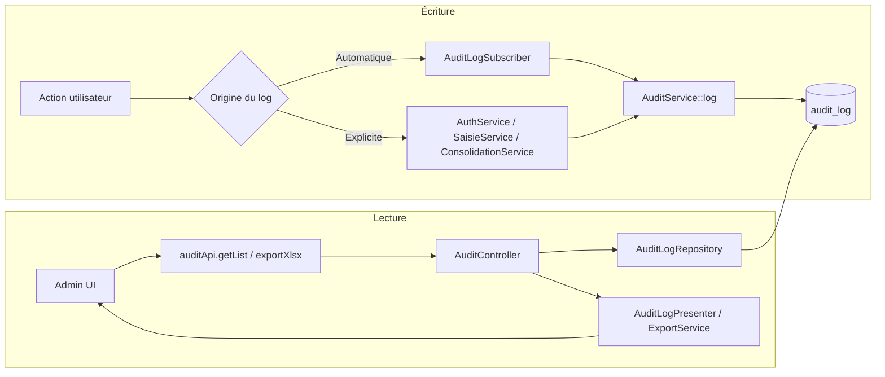
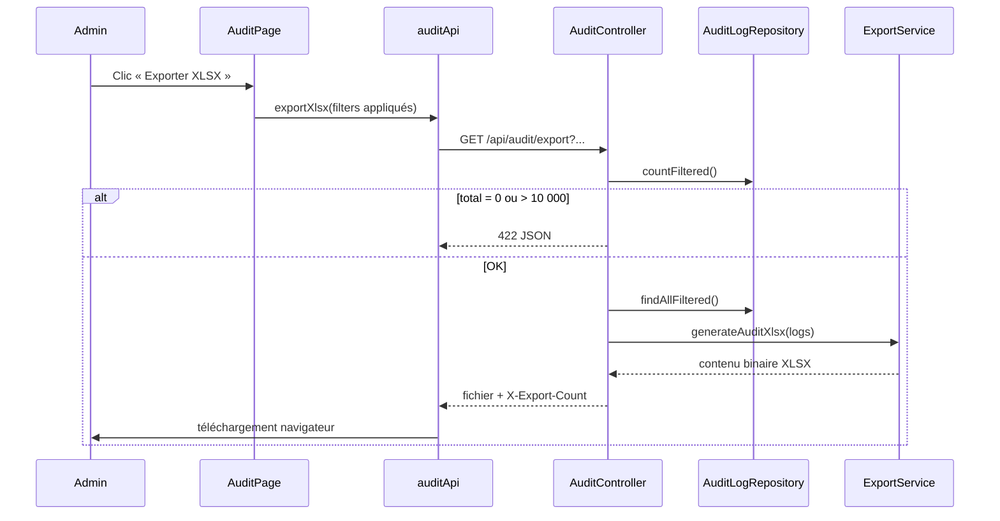
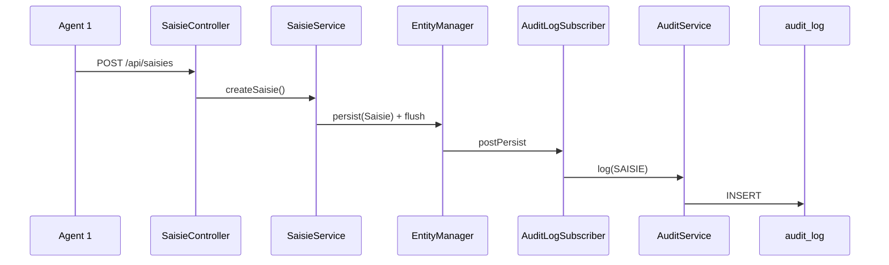
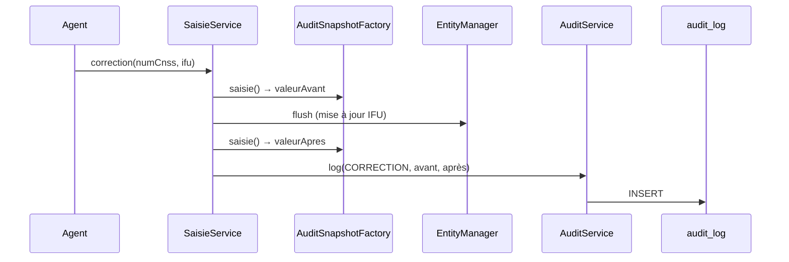
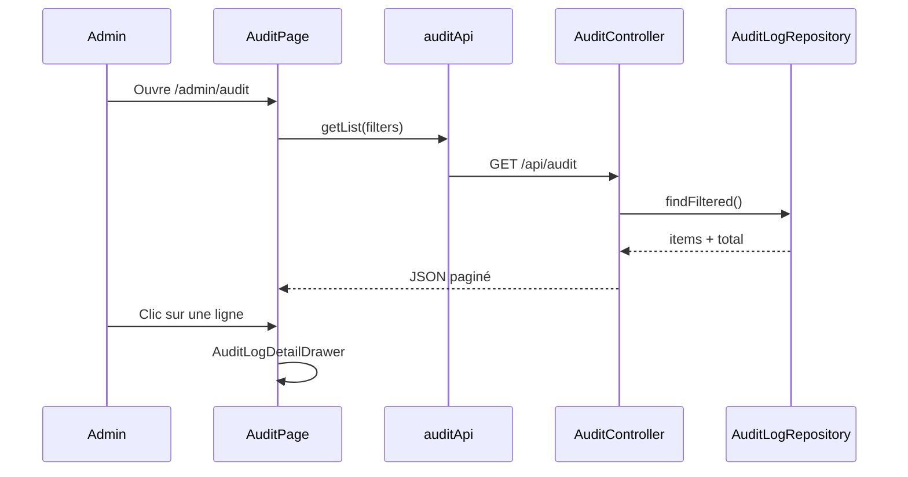

# Documentation — Journal d'audit Arrimage IFU

> **Périmètre :** ce document décrit le **journal d'audit métier** (traçabilité des actions utilisateurs, règle RG-08). Il ne couvre pas les logs techniques Symfony/PHP (Monolog, fichiers `var/log/`), qui ne sont pas configurés de manière spécifique dans ce projet.

---

## 1. Vue d'ensemble

Le journal d'audit enregistre **qui a fait quoi, quand, depuis quelle adresse IP**, avec des snapshots JSON des données concernées. Il répond aux exigences de traçabilité (RG-08) et est **strictement en lecture seule** côté API (RG-13).

| Couche | Rôle |
|--------|------|
| **Base de données** | Table `audit_log` — append-only |
| **Backend** | `AuditService` (écriture DBAL), `AuditLogSubscriber` (écriture automatique), services métier (écriture explicite) |
| **API** | `GET /api/audit` (liste) et `GET /api/audit/export` (XLSX) — `ROLE_ADMIN` |
| **Frontend** | Page `/admin/audit`, drawer de détail, export preuve JSON, export XLSX |



---

## 2. Modèle de données

### 2.1 Table `audit_log`

Créée dans la migration `Version20260616100000` :

| Colonne | Type | Description |
|---------|------|-------------|
| `id` | `SERIAL` | Identifiant auto-incrémenté |
| `user_id` | `INTEGER` | FK vers `utilisateur(id)` — auteur de l'action |
| `action` | `VARCHAR(50)` | Code d'action (voir § 4) |
| `entite_cible` | `VARCHAR(50)` | Classe PHP ou nom d'entité concernée |
| `valeur_avant` | `TEXT` | Snapshot JSON **avant** modification (nullable) |
| `valeur_apres` | `TEXT` | Snapshot JSON **après** modification (nullable) |
| `timestamp` | `TIMESTAMPTZ` | Horodatage UTC avec fuseau |
| `ip_address` | `VARCHAR(45)` | Adresse IP client (IPv4 ou IPv6) |

**Fichiers associés :**

- Entité Doctrine : `backend/src/Entity/AuditLog.php`
- Repository : `backend/src/Repository/AuditLogRepository.php`

### 2.2 Principes d'intégrité

- **Append-only** : aucun endpoint ne permet de modifier ou supprimer une entrée.
- **Pas de récursion** : l'écriture passe par **DBAL** (`Connection::insert`) et non par `EntityManager::persist(AuditLog)`, afin d'éviter que le subscriber Doctrine ne se déclenche à son tour.
- **Exclusion de l'auto-audit** : `AuditLogSubscriber` ignore les entités de type `AuditLog`.

---

## 3. Architecture d'écriture

### 3.1 `AuditService` — point d'entrée unique

**Fichier :** `backend/src/Service/AuditService.php`

Toute écriture dans le journal passe par la méthode `log()` :

```php
$this->auditService->log(
    user: $utilisateur,
    action: 'LOGIN',
    entiteCible: Utilisateur::class,
    valeurAvant: null,           // optionnel
    valeurApres: json_encode($snapshot),
    ipAddress: $request->getClientIp(),
);
```

Le timestamp est généré côté PHP au moment de l'insertion (`Y-m-d H:i:sP`).

### 3.2 `AuditSnapshotFactory` — contenu des snapshots

**Fichier :** `backend/src/Service/AuditSnapshotFactory.php`

Fabrique les objets JSON stockés dans `valeur_avant` / `valeur_apres` :

| Méthode | Champs enregistrés |
|---------|-------------------|
| `saisie(Saisie)` | `num_cnss`, `ifu_agent1`, `ifu_agent2`, `flag_consolide`, `status` |
| `utilisateur(Utilisateur)` | `id`, `username`, `role`, `is_active`, `is_first_connexion` |
| `login(Utilisateur)` | `username`, `role`, `dt_last_login` |
| `refusedAttempt(...)` | `reason`, `num_cnss`, `ifu_attempted`, `existing` (snapshot saisie si applicable) |
| `refusedLogin(...)` | `reason`, `username`, `user` (optionnel), `attempts` (optionnel) |

Les mots de passe ne sont **jamais** inclus dans les snapshots.

### 3.3 `AuditLogSubscriber` — audit automatique Doctrine

**Fichier :** `backend/src/EventListener/AuditLogSubscriber.php`

Écoute les événements Doctrine `postPersist` et `postUpdate`. 

#### Créations (`postPersist`)

| Entité | Action loguée | `valeur_apres` |
|--------|---------------|----------------|
| `Saisie` | `SAISIE` | Snapshot saisie |
| `Utilisateur` | `CREATE_USER` | Snapshot utilisateur |

Conditions : un utilisateur authentifié doit être présent dans le contexte de sécurité Symfony.

#### Modifications (`postUpdate`)

Uniquement pour `Utilisateur` :

| Action | `valeur_apres` |
|--------|----------------|
| `UPDATE_USER` | Snapshot utilisateur |

**Exclusions volontaires** — les mises à jour ne touchant **que** ces champs ne génèrent pas de log :

- `dtLastLogin`
- `nbreTentativesConnexion`
- `dureeVerrouillage`

Cela évite de polluer le journal lors des connexions, tentatives échouées et verrouillages de compte.

> **Conséquence :** un changement de mot de passe (`changePassword`) modifie `password`, `isFirstConnexion` et `dtModification` — ces champs ne sont pas exclus, donc un log `UPDATE_USER` est bien créé.

### 3.4 Écriture explicite dans les services métier

Certaines actions nécessitent un contrôle fin (valeur avant/après, action spécifique) et appellent `AuditService` directement.

| Service | Méthode | Action | `valeur_avant` | `valeur_apres` |
|---------|---------|--------|----------------|----------------|
| `AuthService` | `login()` | `LOGIN` | — | Snapshot login |
| `AuthService` | `login()` (refus) | `LOGIN_REFUSEE` | — | Snapshot tentative refusée |
| `AuthService` | `changePassword()` | `CHANGE_PASSWORD` | Snapshot utilisateur | Snapshot utilisateur |
| `AuthService` | `changePassword()` (refus) | `CHANGE_PASSWORD_REFUSEE` | — | Snapshot tentative refusée |
| `SaisieService` | `contresaisie()` | `CONTRESAISIE` | Snapshot saisie | Snapshot saisie |
| `SaisieService` | `correction()` | `CORRECTION` | Snapshot saisie | Snapshot saisie |
| `SaisieService` | `createSaisie()` (refus) | `SAISIE_REFUSEE` | — | Snapshot tentative refusée |
| `SaisieService` | `contresaisie()` (refus) | `CONTRESAISIE_REFUSEE` | — | Snapshot tentative refusée |
| `UtilisateurService` | `toggleActive()` (désactivation) | `ACCOUNT_DISABLED` | Snapshot utilisateur | Snapshot utilisateur |
| `UtilisateurService` | `toggleActive()` (activation) | `ACCOUNT_ENABLED` | Snapshot utilisateur | Snapshot utilisateur |
| `UtilisateurService` | `resetPassword()` | `RESET_PASSWORD` | Snapshot utilisateur | Snapshot utilisateur |
| `ConsolidationService` | `consolidate()` | `CONSOLIDATION` | — | `{ count, dt_export }` |

#### Détail par flux métier

**Première saisie (UC02)** — `SaisieService::createSaisie()`

1. Persist + flush de l'entité `Saisie`
2. `AuditLogSubscriber::postPersist` → log `SAISIE` automatique

En cas de refus (CNSS inconnu, doublon, entité consolidée) → log explicite `SAISIE_REFUSEE` avec le motif (`reason`) et les données tentées.

**Contre-saisie (UC03)** — `SaisieService::contresaisie()`

1. Capture du snapshot **avant** modification
2. Mise à jour de la saisie + flush
3. Appel explicite `logSaisieAction(..., 'CONTRESAISIE', ..., valeurAvant)`

En cas de refus (non éligible, déjà contre-saisi, entité consolidée) → log explicite `CONTRESAISIE_REFUSEE` avec le motif et les données tentées.

La vérification d'éligibilité (`GET /api/saisie/attente/{numCNSS}`) journalise également les refus lorsque l'Agent 2 recherche un employeur non saisi ou inaccessible.

**Correction (UC05)** — `SaisieService::correction()`

1. Capture du snapshot **avant** modification
2. Mise à jour de l'IFU selon le rôle de l'agent + flush
3. Appel explicite `logSaisieAction(..., 'CORRECTION', ..., valeurAvant)`

**Consolidation / export (UC06)** — `ConsolidationService::consolidate()`

> Documentation complète : [consolidation.md](consolidation.md)

1. Transaction atomique : verrouillage `FOR UPDATE`, génération XLSX, marquage `flag_consolide` et `status = CONSOLIDE`
2. Log `CONSOLIDATION` **avant** le `commit`, avec le nombre d'enregistrements et la date d'export
3. En cas d'échec → rollback, **aucun log CONSOLIDATION** n'est conservé

**Connexion** — `AuthService::login()`

1. Vérifications (compte actif, verrouillage, mot de passe)
2. Reset des tentatives + mise à jour `dtLastLogin` (non auditée grâce à l'exclusion subscriber)
3. Log explicite `LOGIN` avec snapshot login

En cas de refus (identifiant inconnu, compte désactivé, compte verrouillé, mot de passe incorrect) → log explicite `LOGIN_REFUSEE` avec le motif et l'identifiant tenté. Pour un identifiant inconnu, `user_id` est `NULL` dans `audit_log`.

À la 5ᵉ tentative échouée, un second log `LOGIN_REFUSEE` est ajouté avec le motif `ACCOUNT_LOCKOUT` (durée et fin du verrouillage incluses).

**Changement de mot de passe (UC10)** — `AuthService::changePassword()`

1. Vérification du mot de passe actuel
2. Mise à jour du mot de passe + `is_first_connexion = false`
3. Log explicite `CHANGE_PASSWORD` avec snapshots avant/après

En cas de mot de passe actuel incorrect → log `CHANGE_PASSWORD_REFUSEE` avec le motif `INVALID_CURRENT_PASSWORD`. Les mots de passe ne sont jamais stockés dans le journal.

---

## 4. Catalogue des actions

| Code `action` | Déclencheur | Entité cible | UC |
|---------------|-------------|--------------|-----|
| `LOGIN` | Connexion réussie | `App\Entity\Utilisateur` | Auth |
| `LOGIN_REFUSEE` | Tentative de connexion refusée | `App\Entity\Utilisateur` | Auth |
| `CHANGE_PASSWORD` | Changement de mot de passe réussi | `App\Entity\Utilisateur` | UC10 |
| `CHANGE_PASSWORD_REFUSEE` | Tentative de changement de mot de passe refusée | `App\Entity\Utilisateur` | UC10 |
| `ACCOUNT_DISABLED` | Désactivation d'un compte par un admin | `App\Entity\Utilisateur` | UC08 |
| `ACCOUNT_ENABLED` | Réactivation d'un compte par un admin | `App\Entity\Utilisateur` | UC08 |
| `RESET_PASSWORD` | Réinitialisation du mot de passe par un admin | `App\Entity\Utilisateur` | UC08 |
| `SAISIE` | Création d'une saisie IFU | `App\Entity\Saisie` | UC02 |
| `SAISIE_REFUSEE` | Tentative de saisie refusée | `App\Entity\Saisie` | UC02 |
| `CONTRESAISIE` | Contre-saisie agent 2 | `App\Entity\Saisie` | UC03 |
| `CONTRESAISIE_REFUSEE` | Tentative de contre-saisie refusée | `App\Entity\Saisie` | UC03 |
| `CORRECTION` | Correction après discordance | `App\Entity\Saisie` | UC05 |
| `CONSOLIDATION` | Consolidation + export XLSX | `saisie` | UC06 |
| `CREATE_USER` | Création d'un utilisateur | `App\Entity\Utilisateur` | UC08 |
| `UPDATE_USER` | Modification d'un utilisateur | `App\Entity\Utilisateur` | UC08 |

### Actions **non** journalisées aujourd'hui

| Action | Raison |
|--------|--------|
| Déconnexion (`POST /api/auth/logout`) | Non implémenté |
| Refresh token | Non implémenté |
| Limitation de débit login (`RATE_LIMIT`) | Gérée par `LoginRateLimitSubscriber`, pas dans `audit_log` |
| Consultations / lectures API | Hors périmètre RG-08 |
| Erreurs de validation API | Gérées par `ApiExceptionListener`, pas dans `audit_log` |

---

## 5. API de consultation et export

### 5.1 Liste paginée

```
GET /api/audit
```

- **Autorisation :** `ROLE_ADMIN` (`#[IsGranted('ROLE_ADMIN')]`)
- **Contrôleur :** `backend/src/Controller/Api/AuditController.php`

### 5.2 Paramètres de requête (liste et export)

| Paramètre | Type | Description |
|-----------|------|-------------|
| `page` | int | Page courante (défaut : 1) |
| `limit` | int | Taille de page (défaut : 20) |
| `userId` | int | Filtre par auteur |
| `action` | string | Filtre par code d'action |
| `dateFrom` | date (`YYYY-MM-DD`) | Borne inférieure inclusive |
| `dateTo` | date (`YYYY-MM-DD`) | Borne supérieure inclusive (fin de journée 23:59:59) |

> Les paramètres `page` et `limit` s'appliquent uniquement à `GET /api/audit`. L'export XLSX ignore la pagination et retourne **toutes** les entrées correspondant aux filtres.

### 5.3 Format de réponse (liste)

Chaque entrée est formatée par `AuditLogPresenter` :

```json
{
  "success": true,
  "data": {
    "items": [
      {
        "id": 23,
        "timestamp": "2026-06-18T09:45:12+00:00",
        "user": {
          "id": 1,
          "nom": "Dupont",
          "prenom": "Marie",
          "username": "mdupont"
        },
        "action": "CORRECTION",
        "entiteCible": "App\\Entity\\Saisie",
        "valeurAvant": "{\"num_cnss\":\"1234567890\",\"ifu_agent1\":\"...\"}",
        "valeurApres": "{\"num_cnss\":\"1234567890\",\"ifu_agent1\":\"...\"}",
        "ipAddress": "192.168.1.42"
      }
    ],
    "total": 150,
    "page": 1,
    "limit": 20,
    "totalPages": 8
  }
}
```

Les champs `valeurAvant` et `valeurApres` sont des **chaînes JSON** côté API ; le frontend les parse pour l'affichage.

### 5.4 Export XLSX

```
GET /api/audit/export
```

Exporte le journal filtré au format Excel (`.xlsx`). Mêmes paramètres de filtre que la liste (`userId`, `action`, `dateFrom`, `dateTo`), sans pagination.

| Élément | Détail |
|---------|--------|
| **Autorisation** | `ROLE_ADMIN` |
| **Content-Type** | `application/vnd.openxmlformats-officedocument.spreadsheetml.sheet` |
| **Nom du fichier** | `audit_log_YYYYMMDD_HHMMSS.xlsx` (header `Content-Disposition`) |
| **Header `X-Export-Count`** | Nombre d'entrées exportées |
| **Limite** | 10 000 entrées max (`AuditLogRepository::MAX_EXPORT`) |
| **Génération** | `ExportService::generateAuditXlsx()` via PhpSpreadsheet |

**Colonnes du fichier :**

| Colonne | Source |
|---------|--------|
| ID | `audit_log.id` |
| Horodatage | `timestamp` (`Y-m-d H:i:s`) |
| Utilisateur | `username` |
| Nom / Prénom | `utilisateur.nom` / `prenom` |
| Action | code d'action |
| Entité cible | nom court de la classe (ex. `Saisie`) |
| Adresse IP | `ip_address` |
| Valeur avant / après | texte JSON brut |

**Réponses d'erreur (JSON, statut 422) :**

| Code | Cas |
|------|-----|
| `NO_DATA` | Aucune entrée pour les filtres sélectionnés |
| `EXPORT_LIMIT_EXCEEDED` | Plus de 10 000 entrées — affiner les filtres |



---

## 6. Frontend — consultation et affichage

### 6.1 Client API

**Fichier :** `src/api/auditApi.ts`

```typescript
auditApi.getList({ page, limit, userId, action, dateFrom, dateTo })
  → GET /api/audit?...
  → retourne AuditListResponse

auditApi.exportXlsx({ userId, action, dateFrom, dateTo })
  → GET /api/audit/export?...
  → télécharge audit_log_YYYYMMDD_HHMMSS.xlsx
  → retourne { count, filename }
```

L'export utilise `responseType: 'blob'`. En cas d'erreur 422, le corps JSON est extrait depuis le blob pour afficher le message métier.

### 6.2 Page principale

**Fichier :** `src/features/admin/AuditPage.tsx`  
**Route :** `/admin/audit` (réservée au rôle `admin`)

Fonctionnalités :

- Tableau paginé des entrées (8 lignes par page)
- Filtres : utilisateur, action, plage de dates
- **Appliquer les filtres** — copie le brouillon (`draft`) vers les filtres actifs (`filters`) et recharge la liste
- **Réinitialiser les filtres** — remet formulaire et filtres actifs à l'état par défaut, réinitialise le toggle Succès/Échec
- **Exporter XLSX** — exporte selon les filtres **déjà appliqués** (pas le brouillon en attente)
- Filtres locaux succès / échec (voir § 6.4) — **non pris en compte** par l'export XLSX
- KPI : volume total, connexions actives du jour, dernier export, anomalies détectées
- Clic sur une ligne → ouverture du drawer de détail

La page est également consommée indirectement par :

- `DashboardPage.tsx` — derniers exports
- `ConsolidationPage.tsx` — date du dernier export

### 6.3 Identifiant lisible

**Fichier :** `src/utils/formatAuditLog.ts`

Chaque entrée reçoit un identifiant d'affichage dérivé (non stocké en base) :

```
#LOG-{année}-{code}-{id sur 5 chiffres}
```

Exemple : `#LOG-2026-COR-00023`

| Action | Code |
|--------|------|
| `LOGIN` | `LOG` |
| `SAISIE` | `SAI` |
| `CONTRESAISIE` | `CTS` |
| `CORRECTION` | `COR` |
| `CONSOLIDATION` | `CSD` |
| `CREATE_USER` | `CRU` |
| `UPDATE_USER` | `UPU` |

### 6.4 Détection succès / échec (UI uniquement)

**Fichier :** `src/features/admin/adminShared.tsx`

La fonction `isAuditFailure()` analyse le texte de `valeurAvant` et `valeurApres` à la recherche des mots `échec`, `error` ou `failed`. C'est une **heuristique d'affichage** : le backend ne stocke pas de champ `success` / `failure`.

En pratique, la quasi-totalité des entrées actuelles sont des actions réussies ; ce filtre anticipe des cas futurs ou des messages d'erreur encodés dans les snapshots.

### 6.5 Drawer de détail et export de preuve

**Fichier :** `src/features/admin/AuditLogDetailDrawer.tsx`

Affiche : identifiant, horodatage, action, utilisateur, rôle, entité cible, IP, bloc JSON before/after.

Le bouton **« Télécharger preuve »** génère un fichier JSON local :

```json
{
  "identifiant": "#LOG-2026-COR-00023",
  "horodatage": "2026-06-18T09:45:12+00:00",
  "utilisateur": { "id": 1, "nom": "...", "prenom": "...", "username": "..." },
  "role": "agent1",
  "action": "CORRECTION",
  "entiteCible": "App\\Entity\\Saisie",
  "ipAddress": "192.168.1.42",
  "valeursModifiees": { "before": { ... }, "after": { ... } },
  "exporteLe": "2026-06-18T10:00:00.000Z"
}
```

Nom du fichier : `preuve-audit-LOG-2026-COR-00023.json`

> **Distinction :** l'export **preuve JSON** (drawer, une entrée) est généré entièrement côté navigateur. L'export **XLSX** (bouton page, entrées filtrées) passe par l'API backend — voir § 5.4.

---

## 7. Schémas de flux

### 7.1 Saisie IFU (création)



### 7.2 Correction avec avant/après



### 7.3 Consultation admin



---

## 8. Sécurité et conformité

| Règle | Implémentation |
|-------|----------------|
| **RG-08** — Traçabilité | Toutes les actions métier critiques sont journalisées avec auteur, horodatage et IP |
| **RG-13** — Lecture seule | Aucune route `POST`/`PATCH`/`DELETE` sur `/api/audit` ; pas de `set*` exposé via API |
| **RG-09** — Auth | Consultation réservée aux administrateurs (`ROLE_ADMIN`) |
| **Données sensibles** | Mots de passe exclus des snapshots ; JWT jamais logués |

### Adresse IP

Récupérée via `RequestStack::getCurrentRequest()?->getClientIp()`. Derrière un reverse proxy, la fiabilité dépend de la configuration Symfony (`trusted_proxies` / `X-Forwarded-For`).

---

## 9. Fichiers de référence

### Backend

| Fichier | Rôle |
|---------|------|
| `src/Entity/AuditLog.php` | Entité ORM |
| `src/Service/AuditService.php` | Écriture DBAL |
| `src/Service/AuditSnapshotFactory.php` | Snapshots JSON |
| `src/Service/AuditLogPresenter.php` | Sérialisation API |
| `src/EventListener/AuditLogSubscriber.php` | Audit automatique Doctrine |
| `src/Repository/AuditLogRepository.php` | Requêtes filtrées, `findAllFiltered`, `MAX_EXPORT` |
| `src/Controller/Api/AuditController.php` | Liste + export XLSX |
| `src/Service/ExportService.php` | `generateAuditXlsx()` |
| `src/Service/AuthService.php` | Log `LOGIN` |
| `src/Service/SaisieService.php` | Logs `CONTRESAISIE`, `CORRECTION` |
| `src/Service/ConsolidationService.php` | Log `CONSOLIDATION` |

### Frontend

| Fichier | Rôle |
|---------|------|
| `src/api/auditApi.ts` | `getList`, `exportXlsx` |
| `src/types/admin.ts` | Types `AuditEntry`, `AuditFilters` |
| `src/features/admin/AuditPage.tsx` | Page principale, filtres, export XLSX |
| `src/features/admin/AuditLogDetailDrawer.tsx` | Détail + export preuve |
| `src/utils/formatAuditLog.ts` | Identifiant et parsing JSON |
| `src/features/admin/adminShared.tsx` | Badges, `isAuditFailure`, `parseExportCount` |

---

## 10. Extension du système

Pour journaliser une **nouvelle action** :

1. Choisir un code `action` explicite (ex. `LOGOUT`, `DELETE_USER`).
2. Décider du mode d'écriture :
   - **Automatique** : ajouter l'entité et l'action dans `AuditLogSubscriber::CREATE_ACTIONS` ou étendre `postUpdate`.
   - **Explicite** : appeler `AuditService::log()` depuis le service métier (recommandé si `valeur_avant` est nécessaire).
3. Ajouter un snapshot dans `AuditSnapshotFactory` si de nouveaux champs doivent être tracés.
4. Mettre à jour le frontend :
   - `ACTIONS` dans `AuditPage.tsx`
   - `ACTION_CODES` dans `formatAuditLog.ts`
   - `ActionBadge` dans `adminShared.tsx` si un libellé visuel est requis.

**Bonnes pratiques :**

- Toujours passer par `AuditService` — ne jamais insérer directement via l'EntityManager.
- Ne jamais inclure de secrets (mdp, tokens) dans les snapshots.
- Pour les opérations transactionnelles, logger **après** la logique métier validée et **avant** le commit si l'action doit être annulée en cas de rollback (comme `CONSOLIDATION`).
