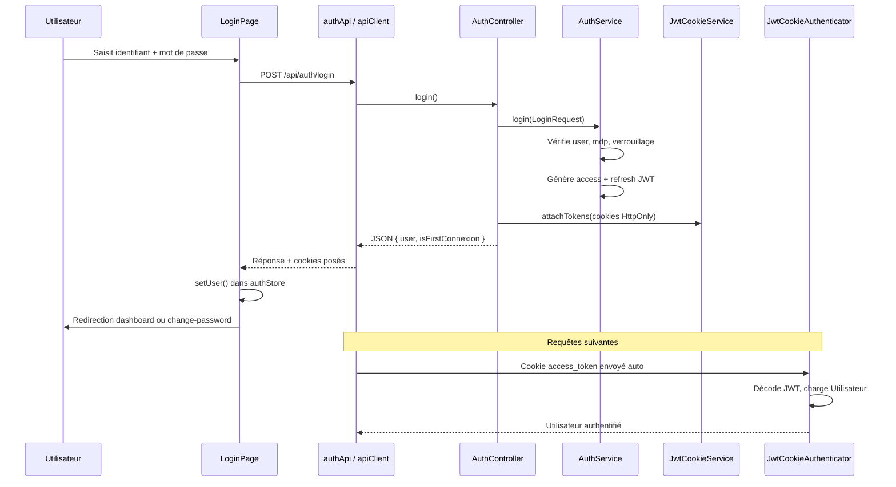

# Documentation — Authentification Arrimage IFU

> **Note importante :** la connexion n'utilise pas le composant `Modal` React. C'est une **page dédiée** (`LoginPage`) avec une carte centrée (style « modal » visuel). Le seul vrai modal lié à l'auth est la **confirmation de déconnexion** dans la sidebar.

---

## 1. Vue d'ensemble

L'authentification repose sur des **JWT stockés en cookies HttpOnly** (jamais exposés au JavaScript frontend). Le frontend ne garde que l'**état utilisateur** en mémoire (Zustand) : identité, rôle, première connexion.

| Couche | Rôle |
|--------|------|
| **Frontend** | Formulaire login, store Zustand, intercepteur Axios, routes protégées |
| **Backend API** | `AuthController` → `AuthService` → cookies JWT |
| **Sécurité Symfony** | `JwtCookieAuthenticator` lit `access_token` sur chaque requête `/api/*` |

**Durées des tokens** (configurables via `.env`) :

- Access token : **1 h** (`JWT_ACCESS_TOKEN_TTL`)
- Refresh token : **24 h** (`JWT_REFRESH_TOKEN_TTL`)

---

## 2. Schéma global



---

## 3. Flux de connexion (login) — étape par étape

### 3.1 Frontend — formulaire

**Fichier :** `src/features/auth/LoginPage.tsx`

1. **Validation locale** avec Zod + React Hook Form :
   - `username` et `password` obligatoires
2. À la soumission, `onSubmit()` appelle `authApi.login(username, password)`
3. En cas de succès :
   - `setUser(response.user, response.isFirstConnexion)` met à jour le store
   - Si `isFirstConnexion === true` → sauvegarde du mot de passe temporaire en `sessionStorage` et redirection vers `/change-password`
   - Sinon → redirection vers le dashboard selon le rôle (`ROLE_DASHBOARD`)
4. En cas d'erreur → affichage du message serveur dans une `Alert`

### 3.2 Frontend — client API

**Fichier :** `src/api/authApi.ts`

```typescript
authApi.login(username, password)
  → POST /api/auth/login { username, password }
  → retourne data.data (LoginResponse)
```

**Fichier :** `src/api/client.ts`

- Instance Axios avec `withCredentials: true` → les cookies sont **envoyés et reçus automatiquement** par le navigateur
- Pas de token dans `localStorage` ni dans les headers `Authorization`

### 3.3 Backend — point d'entrée HTTP

**Fichier :** `backend/src/Controller/Api/AuthController.php` — méthode `login()`

| Étape | Action |
|-------|--------|
| 1 | Parse le JSON `{ username, password }` |
| 2 | Construit un `LoginRequest` DTO |
| 3 | Valide avec Symfony Validator (`LoginRequest.php`) |
| 4 | Appelle `AuthService::login()` |
| 5 | Gère les exceptions → codes HTTP (401, 403, 423) |
| 6 | Sérialise l'utilisateur en JSON |
| 7 | Appelle `JwtCookieService::attachTokens()` pour poser les cookies |
| 8 | Retourne `{ user, isFirstConnexion, expiresAt }` |

**Firewall Symfony** (`security.yaml`) : `/api/auth/login` est en `security: false` (pas d'authentification requise).

**Rate limiting** (`LoginRateLimitSubscriber.php`) : avant même le contrôleur, limite les tentatives par IP sur `POST /api/auth/login` (réponse 429 si dépassé).

### 3.4 Backend — logique métier

**Fichier :** `backend/src/Service/AuthService.php` — méthode `login()`

```
1. findOneByUsername(username)          → UtilisateurRepository
2. Vérifie isActive()                   → AccountDisabledException (403)
3. Vérifie isAccountLocked()            → AccountLockedException (423)
   └─ 5 échecs → verrouillage 5 min
4. passwordHasher->isPasswordValid()    → sinon registerFailedAttempt() + InvalidCredentialsException (401)
5. resetLoginAttempts() + dtLastLogin
6. auditService->log(action: 'LOGIN')
7. jwtManager->create(user)             → access token
8. createRefreshToken(user)             → refresh token (payload type: 'refresh')
9. Retourne { user, accessToken, refreshToken, expiresAt }
```

### 3.5 Backend — cookies JWT

**Fichier :** `backend/src/Service/JwtCookieService.php`

| Cookie | Nom | Path | Durée | HttpOnly |
|--------|-----|------|-------|----------|
| Access | `access_token` | `/api` | 1 h | Oui |
| Refresh | `refresh_token` | `/api/auth/refresh` | 24 h | Oui |

Les deux cookies sont `SameSite=Strict` et `Secure` selon `JWT_SECURE_COOKIES`.

---

## 4. Vérification de session au démarrage

**Fichier :** `src/main.tsx`  
`SessionVerifier` enveloppe toute l'application **avant** le routeur.

**Fichier :** `src/components/layout/SessionVerifier.tsx`

```
Au mount de l'app :
1. GET /api/auth/me
   ├─ Succès → setUser(user, isFirstConnexion), isLoading = false
   └─ Échec (401) :
       2. POST /api/auth/refresh  (utilise cookie refresh_token)
          ├─ Succès → re-GET /api/auth/me → setUser()
          └─ Échec → logout()
```

Pendant `isLoading === true`, `ProtectedRoute` affiche un spinner.

### Côté backend pour `/me`

1. Requête arrive sur firewall `api`
2. `JwtCookieAuthenticator::supports()` → true (sauf login/refresh)
3. `authenticate()` lit `access_token` du cookie, décode le JWT via Lexik
4. Charge l'utilisateur via `UtilisateurRepository::findOneByUsername()`
5. `UserChecker::checkPreAuth()` vérifie compte actif et non verrouillé
6. `AuthController::me()` retourne l'utilisateur courant (`$this->getUser()`)

---

## 5. Refresh automatique sur 401

**Fichier :** `src/api/client.ts` — intercepteur de réponse Axios

Quand une requête API retourne **401** (sauf `/auth/login`) :

```
1. Si c'est /auth/me → rejette (SessionVerifier gère)
2. Si c'est /auth/refresh → logout + redirect /login
3. Sinon :
   a. Si un refresh est déjà en cours → met la requête en file d'attente
   b. Sinon POST /api/auth/refresh
      ├─ Succès → rejoue la requête originale
      └─ Échec → logout + redirect /login
```

**Backend refresh** (`AuthController::refresh()` + `AuthService::refresh()`) :

- Lit `refresh_token` du cookie
- Vérifie que le payload a `type === 'refresh'`
- Génère un nouveau couple access + refresh
- Repose les cookies via `JwtCookieService`

---

## 6. Protection des routes frontend

**Fichier :** `src/router/index.tsx`  
**Fichier :** `src/components/layout/ProtectedRoute.tsx`

Ordre des vérifications :

```
isLoading ? → Spinner
!isAuthenticated ? → /login
isFirstConnexion && pas sur /change-password ? → /change-password
rôle non autorisé ? → /unauthorized
sinon → <Outlet /> (page demandée)
```

Routes publiques : `/login`, `/change-password`  
Routes par rôle : `agent1`, `agent2`, `controleur`, `admin`

**Fichier :** `src/store/authStore.ts`  
État global Zustand :

| Champ | Description |
|-------|-------------|
| `user` | Profil connecté (`AuthUser`) |
| `isAuthenticated` | Session active |
| `isFirstConnexion` | Doit changer son mot de passe |
| `isLoading` | Vérification session en cours |
| `pendingTempPassword` | Mdp temporaire (sessionStorage) pour 1ère connexion |

---

## 7. Première connexion (changement de mot de passe)

**Fichier :** `src/features/auth/ChangePasswordPage.tsx`

1. Accessible seulement si authentifié + `isFirstConnexion` + `pendingTempPassword` en sessionStorage
2. `authApi.changePassword(tempPassword, newPassword, confirmPassword)`
3. Backend `AuthService::changePassword()` :
   - Vérifie l'ancien mot de passe
   - Hash le nouveau (bcrypt coût 12)
   - `setIsFirstConnexion(false)`
4. Frontend : `setUser(user, false)` + `clearPendingTempPassword()`

`ProtectedRoute` redirige automatiquement vers `/change-password` tant que `isFirstConnexion` est vrai.

---

## 8. Déconnexion

**Fichier :** `src/components/layout/Sidebar.tsx`

1. Clic « Déconnexion » → ouvre le **Modal** de confirmation
2. Confirmation → `authApi.logout()` → `POST /api/auth/logout`
3. Backend : `JwtCookieService::clearTokens()` invalide les cookies
4. Frontend : `logout()` vide le store + `navigate('/login')`

---

## 9. Protection des routes API (backend)

**Fichier :** `backend/config/packages/security.yaml`

| Route | Accès |
|-------|-------|
| `POST /api/auth/login` | Public |
| `POST /api/auth/refresh` | Public |
| `GET /api/auth/me` | Authentifié |
| `POST /api/auth/logout` | Authentifié |
| `POST /api/auth/change-password` | Authentifié |
| `/api/employeur/*` | `ROLE_AGENT1` |
| `/api/saisie/*` | Selon rôle |
| `/api/audit`, `/api/utilisateurs` | `ROLE_ADMIN` |
| etc. | … |

**Fichier :** `backend/src/Security/JwtCookieAuthenticator.php`  
Point d'entrée pour toute requête non authentifiée → JSON 401 `{ code: "UNAUTHORIZED" }`.

---

## 10. Inventaire des fichiers

### Frontend

| Fichier | Rôle |
|---------|------|
| `main.tsx` | Monte `SessionVerifier` + routeur |
| `features/auth/LoginPage.tsx` | Formulaire de connexion |
| `features/auth/ChangePasswordPage.tsx` | Changement mdp 1ère connexion |
| `api/authApi.ts` | Appels REST auth |
| `api/client.ts` | Axios + refresh auto sur 401 |
| `store/authStore.ts` | État utilisateur (Zustand) |
| `types/auth.ts` | Types `AuthUser`, `LoginResponse` |
| `components/layout/SessionVerifier.tsx` | Restauration session au boot |
| `components/layout/ProtectedRoute.tsx` | Garde auth + rôle |
| `components/layout/Sidebar.tsx` | Modal déconnexion |
| `router/index.tsx` | Définition des routes |
| `utils/constants.ts` | `ROLE_DASHBOARD`, TTL tokens |

### Backend

| Fichier | Rôle |
|---------|------|
| `Controller/Api/AuthController.php` | Endpoints login/refresh/logout/me/change-password |
| `Service/AuthService.php` | Logique login, refresh, change-password, verrouillage |
| `Service/JwtCookieService.php` | Création/suppression cookies JWT |
| `Security/JwtCookieAuthenticator.php` | Lecture JWT depuis cookie sur chaque requête |
| `Security/UserChecker.php` | Vérif compte actif / verrouillé post-JWT |
| `DTO/LoginRequest.php` | Validation entrée login |
| `DTO/ChangePasswordRequest.php` | Validation changement mdp |
| `Entity/Utilisateur.php` | Entité utilisateur + rôles Symfony |
| `Repository/UtilisateurRepository.php` | Recherche par username |
| `EventListener/LoginRateLimitSubscriber.php` | Anti brute-force par IP |
| `config/packages/security.yaml` | Firewalls + access_control |
| `config/packages/lexik_jwt_authentication.yaml` | Config Lexik JWT (HS256) |
| `config/services.yaml` | Injection TTL cookies, rate limiter |

---

## 11. Réponse JSON typique au login

```json
{
  "success": true,
  "data": {
    "user": {
      "id": 1,
      "username": "agent1",
      "role": "agent1",
      "nom": "Dupont",
      "prenom": "Jean",
      "isActive": true,
      "dtLastLogin": "2026-06-18T10:30:00+00:00"
    },
    "isFirstConnexion": false,
    "expiresAt": "2026-06-18T11:30:00+00:00"
  }
}
```

Les tokens JWT ne figurent **pas** dans le JSON — ils sont uniquement dans les cookies `Set-Cookie`.

---

## 12. Codes d'erreur possibles au login

| Code | HTTP | Cause |
|------|------|-------|
| `VALIDATION_ERROR` | 422 | Champs vides ou invalides |
| `INVALID_CREDENTIALS` | 401 | Identifiant ou mot de passe incorrect |
| `ACCOUNT_DISABLED` | 403 | Compte désactivé |
| `ACCOUNT_LOCKED` | 423 | 5 échecs → verrouillage 5 min |
| `RATE_LIMIT` | 429 | Trop de tentatives depuis la même IP |
