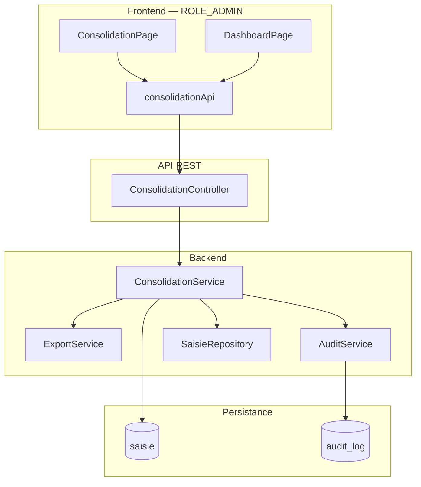
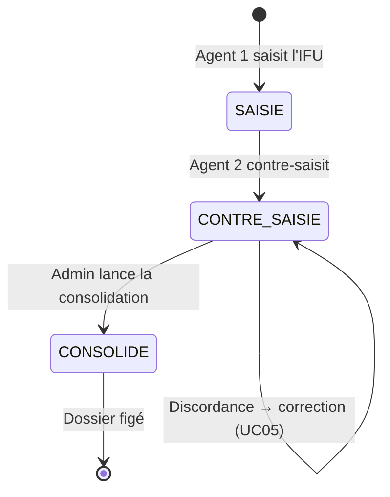
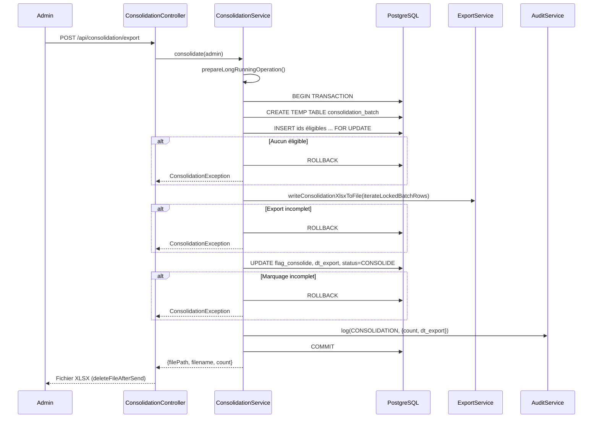
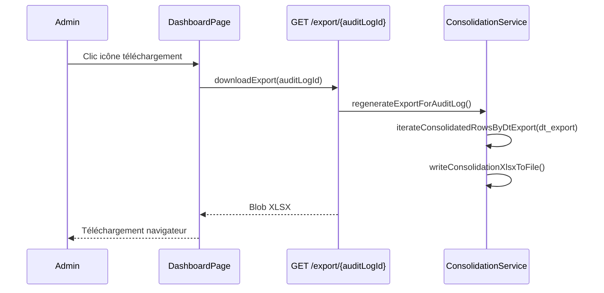

# Documentation — Module de consolidation Arrimage IFU

> **Périmètre :** ce document décrit le module de **consolidation et export XLSX** (UC06). Il couvre le contexte métier, les règles d'éligibilité, la transaction atomique côté backend, la génération du fichier, l'interface administrateur, le re-téléchargement depuis le tableau de bord, l'audit et le verrouillage post-consolidation.
>
> **Documents liés :** [Journal d'audit](audit-logs.md) (action `CONSOLIDATION`), [Authentification](authentification.md) (accès `ROLE_ADMIN`).

---

## 1. Vue d'ensemble

La consolidation est l'**étape finale** du processus d'arrimage des IFU. Elle permet à un **administrateur** de :

1. **Exporter** en fichier Excel (`.xlsx`) l'ensemble des dossiers IFU **concordants** (double saisie validée).
2. **Figer** ces dossiers en base de données (`flag_consolide`, `status = CONSOLIDE`, `dt_export`).
3. **Tracer** l'opération dans le journal d'audit (`action = CONSOLIDATION`).

Cette opération est **irréversible** et **atomique** : soit tout réussit (fichier + marquage + audit), soit rien n'est persisté (RG-06).

| Couche | Rôle |
|--------|------|
| **UI principale** | `ConsolidationPage` — aperçu, indicateurs, lancement de l'export |
| **UI secondaire** | `DashboardPage` — historique des 5 derniers exports + re-téléchargement |
| **API client** | `consolidationApi` — preview, export, download |
| **Contrôleur** | `ConsolidationController` — 3 endpoints REST sous `/api/consolidation` |
| **Métier** | `ConsolidationService` — transaction, verrouillage, audit |
| **Export** | `ExportService::writeConsolidationXlsxToFile()` — génération XLSX en streaming (OpenSpout) |
| **Données** | `SaisieRepository` — compteurs d'éligibilité, doublons, itération SQL des lignes |
| **Sécurité** | `ROLE_ADMIN` requis ; verrouillage via `EntiteConsolideeException` (RG-07) |



---

## 2. Contexte métier

### 2.1 Position dans le workflow

La consolidation intervient **après** la double saisie :



| Référence | Description |
|-----------|-------------|
| **UC06** | Consolidation et export XLSX des IFU concordants |
| **RG-06** | Consolidation **atomique** : export + marquage dans une seule transaction |
| **RG-07** | Verrouillage après consolidation : aucune modification ultérieure |
| **RG-08** | Traçabilité de l'export via le journal d'audit (`CONSOLIDATION`) |

### 2.2 Règles d'éligibilité

Un enregistrement `saisie` est **éligible** à la consolidation si et seulement si les **trois conditions** suivantes sont remplies :

| Condition SQL | Signification |
|---------------|---------------|
| `flag_consolide = false` | Le dossier n'a pas encore été exporté |
| `ifu_agent2 IS NOT NULL` | L'Agent 2 a effectué la contre-saisie |
| `ifu_agent1 = ifu_agent2` | Les deux agents concordent sur le même IFU |

**Exclus du périmètre :**

- Les dossiers **en attente** de contre-saisie (`ifu_agent2 IS NULL`).
- Les **discordances** (`ifu_agent1 ≠ ifu_agent2`) — à corriger via UC05 avant toute consolidation.
- Les dossiers **déjà consolidés** (`flag_consolide = true` / `status = CONSOLIDE`).

**Implémentation :** critères partagés entre `countRestants()`, `countEligibleDuplicateCnss()`, `lockEligibleBatch()` et les itérateurs SQL.

```php
->where('s.flagConsolide = false')
->andWhere('s.ifuAgent2 IS NOT NULL')
->andWhere('s.ifuAgent1 = s.ifuAgent2')
```

---

## 3. Modèle de données

### 3.1 Champs impactés sur `saisie`

| Colonne | Type | Avant consolidation | Après consolidation |
|---------|------|---------------------|---------------------|
| `status` | `VARCHAR(20)` | `SAISIE` ou `CONTRE_SAISIE` | **`CONSOLIDE`** |
| `flag_consolide` | `BOOLEAN` | `false` | **`true`** |
| `dt_export` | `TIMESTAMP` | `NULL` | **Date/heure de l'export** |

**Contrainte SQL sur `status` :**

```sql
CHECK (status IN ('SAISIE', 'CONTRE_SAISIE', 'CONSOLIDE'))
```

Migration d'ajout du statut `CONSOLIDE` : `Version20260618120000`.

### 3.2 Distinction `status` vs `flag_consolide`

| Champ | Rôle |
|-------|------|
| `status` | Étape du **workflow de saisie** visible par les agents (`SAISIE` → `CONTRE_SAISIE` → `CONSOLIDE`) |
| `flag_consolide` | Indicateur technique de **verrouillage** ; utilisé par les stats admin et le blocage des modifications |
| `dt_export` | Horodatage de l'export ; sert au **re-téléchargement** et à l'affichage de la date de consolidation |

Les trois champs sont mis à jour **simultanément** lors de la consolidation.

### 3.3 Entrée d'audit `CONSOLIDATION`

Lors de chaque consolidation réussie, une ligne est ajoutée dans `audit_log` :

| Champ | Valeur |
|-------|--------|
| `action` | `CONSOLIDATION` |
| `entite_cible` | `saisie` |
| `valeur_apres` | `{"count": N, "dt_export": "YYYY-MM-DD HH:MM:SS"}` |
| `valeur_avant` | `NULL` |
| `user_id` | Administrateur ayant lancé l'export |
| `ip_address` | IP du client HTTP |

Voir [audit-logs.md § 3.2](audit-logs.md) pour le détail du mécanisme d'écriture.

---

## 4. API REST

**Préfixe :** `/api/consolidation`  
**Authentification :** cookie JWT (session HttpOnly)  
**Autorisation :** `ROLE_ADMIN` uniquement (`security.yaml`)

### 4.1 Aperçu — `GET /api/consolidation/preview`

Retourne les **statistiques d'aperçu** des dossiers éligibles **sans modifier** la base. Aucune ligne détaillée n'est renvoyée (optimisation pour les gros volumes).

**Réponse (200) :**

```json
{
  "success": true,
  "data": {
    "count": 125000,
    "duplicateCount": 42
  }
}
```

| Champ | Source | Description |
|-------|--------|-------------|
| `count` | `SaisieRepository::countRestants()` | Nombre total de dossiers éligibles (`flag_consolide = false`, concordants) |
| `duplicateCount` | `SaisieRepository::countEligibleDuplicateCnss()` | Lignes « en trop » partageant le même N° CNSS parmi les éligibles |

**Calcul des doublons (SQL) :**

```sql
SELECT COUNT(*) - COUNT(DISTINCT s.num_cnss)
FROM saisie s
WHERE s.flag_consolide = false
  AND s.ifu_agent2 IS NOT NULL
  AND s.ifu_agent1 = s.ifu_agent2
```

Équivalent métier : pour chaque N° CNSS apparaissant plusieurs fois, on compte les occurrences au-delà de la première (ex. 3 lignes pour le même CNSS → 2 doublons).

### 4.2 Consolidation — `POST /api/consolidation/export`

Lance la consolidation atomique et retourne le **fichier XLSX binaire** (pas de JSON).

**Corps :** vide (`null`)

**Réponse succès (200) :**

| En-tête | Valeur |
|---------|--------|
| `Content-Type` | `application/vnd.openxmlformats-officedocument.spreadsheetml.sheet` |
| `Content-Disposition` | `attachment; filename="consolidation_ifu_YYYYMMDD_HHMMSS.xlsx"` |
| `X-Export-Count` | Nombre de lignes exportées |

**Réponse erreur (422) :**

```json
{
  "success": false,
  "error": {
    "code": "NO_DATA",
    "message": "Aucune donnée concordante en attente de consolidation."
  }
}
```

### 4.3 Re-téléchargement — `GET /api/consolidation/export/{auditLogId}`

Régénère le fichier XLSX d'un export **déjà effectué**, identifié par l'ID d'une entrée `audit_log` de type `CONSOLIDATION`.

**Réponse succès (200) :** même format binaire que `POST /export`.

**Réponse erreur (404) :**

```json
{
  "success": false,
  "error": {
    "code": "NOT_FOUND",
    "message": "Export introuvable."
  }
}
```

---

## 5. Transaction atomique (backend)

**Fichier :** `backend/src/Service/ConsolidationService.php` — méthode `consolidate()`



### 5.1 Étapes détaillées

| Étape | Action | Détail |
|-------|--------|--------|
| 1 | Préparation | `memory_limit` porté à 1024 Mo, `set_time_limit(0)`, timeouts PostgreSQL désactivés pour la session |
| 2 | `BEGIN` | Ouverture de la transaction |
| 3 | Verrouillage | Table temporaire `consolidation_batch` + `INSERT ... SELECT ... FOR UPDATE` — empêche deux consolidations concurrentes sur les mêmes lignes |
| 4 | Contrôle | Si le lot est vide → exception `Aucune donnée concordante...` |
| 5 | Génération XLSX | `writeConsolidationXlsxToFile()` en **streaming** vers un fichier temporaire ; itération SQL ligne par ligne (sans hydrater les entités Doctrine) |
| 6 | Cohérence export | Si `exportedCount ≠ expectedCount` → rollback |
| 7 | Mise à jour | `UPDATE saisie SET flag_consolide=true, dt_export=:now, status='CONSOLIDE'` via jointure sur `consolidation_batch` |
| 8 | Cohérence marquage | Si `updated ≠ expectedCount` → rollback |
| 9 | Audit | `AuditService::log()` avec `valeur_apres` JSON |
| 10 | `COMMIT` | Validation définitive |
| 11 | Retour | Chemin du fichier temporaire + nom + compteur ; le contrôleur envoie le binaire avec `deleteFileAfterSend(true)` |

### 5.2 Garanties en cas d'échec

| Scénario | Comportement |
|----------|--------------|
| Erreur technique (SQL, XLSX, etc.) | `ROLLBACK` complet — aucune ligne marquée, **aucun log CONSOLIDATION** |
| Exception métier (`ConsolidationException`) | Idem — état inchangé |
| Succès partiel impossible | La transaction garantit l'atomicité RG-06 |

---

## 6. Fichier XLSX exporté

### 6.1 Stockage

Le fichier **n'est pas archivé** de façon permanente sur le serveur. Lors de chaque export ou re-téléchargement :

- un fichier **temporaire** `.xlsx` est créé sur le disque (`ExportService::createTempXlsxPath()`) ;
- les lignes sont écrites en **streaming** (OpenSpout) ;
- le binaire est transmis au navigateur via HTTP ;
- le fichier temporaire est **supprimé** après envoi (`BinaryFileResponse::deleteFileAfterSend(true)`).

La **source de vérité** pour reconstituer un export est la combinaison `audit_log` (`dt_export`) + lignes `saisie` consolidées.

### 6.2 Nom du fichier

```
consolidation_ifu_YYYYMMDD_HHMMSS.xlsx
```

| Cas | Horodatage utilisé |
|-----|-------------------|
| Nouvelle consolidation (`POST /export`) | Date/heure **du moment** de l'export |
| Re-téléchargement (`GET /export/{id}`) | `dt_export` **enregistré** dans l'audit d'origine |

**Exemple :** `consolidation_ifu_20260618_104635.xlsx`

### 6.3 Structure du fichier

**Feuille :** `Consolidation IFU`

| Colonne | Type Excel | Contenu |
|---------|------------|---------|
| `num_cnss` | **Texte** (`@`) | Numéro CNSS de l'employeur |
| `ifu` | **Texte** (`@`) | IFU retenu (`ifu_agent1`) |
| `raison_sociale` | Texte | Raison sociale de l'employeur |

**Format texte :** les colonnes `num_cnss` et `ifu` sont écrites comme chaînes de caractères pour éviter la notation scientifique sur les identifiants numériques.

**Implémentation principale :** `ExportService::writeConsolidationXlsxToFile()` — bibliothèque **OpenSpout**, itération sur un `iterable` de lignes (adapté aux volumes massifs).

> **Note :** `ExportService::generateXlsx()` (PhpSpreadsheet, en mémoire) existe encore pour d'autres usages legacy/tests, mais **n'est plus utilisé** par le flux de consolidation en production.

---

## 7. Re-téléchargement d'un export passé

### 7.1 Principe

`ConsolidationService::regenerateExportForAuditLog(int $auditLogId)` :

1. Charge l'entrée `audit_log` par ID.
2. Vérifie `action = CONSOLIDATION`.
3. Parse `valeur_apres` → extrait `dt_export` et `count`.
4. Parcourt les saisies via `SaisieRepository::iterateConsolidatedRowsByDtExport($dtExport)`.
5. Régénère le XLSX avec `ExportService::writeConsolidationXlsxToFile()`.
6. Vérifie que le nombre de lignes exportées correspond au `count` enregistré dans l'audit.

### 7.2 Interface tableau de bord

**Fichier :** `src/features/admin/DashboardPage.tsx`

La section **« Derniers exports générés »** :

- charge les 5 derniers logs `CONSOLIDATION` via `auditApi.getList({ action: 'CONSOLIDATION', limit: 5 })` ;
- affiche date, nombre d'IFU, auteur, statut ;
- l'icône de téléchargement appelle `consolidationApi.downloadExport(entry.id)`.



---

## 8. Interface frontend — page Consolidation

**Route :** `/admin/consolidation`  
**Fichier :** `src/features/admin/ConsolidationPage.tsx`

### 8.1 Données chargées au montage

| Requête | Clé React Query | Usage |
|---------|-----------------|-------|
| `GET /api/consolidation/preview` | `consolidation-preview` | Compteur éligibles + doublons CNSS |
| `GET /api/stats` | `stats` | Taux de concordance global |
| `GET /api/audit?action=CONSOLIDATION&limit=1` | `audit/last-export` | Date dernière consolidation |

### 8.2 Indicateurs affichés

| Indicateur | Calcul |
|------------|--------|
| **Dossiers en attente** | `preview.count` — total exact côté serveur |
| **Pourcentage concordance** | `concordants / (concordants + discordants) × 100` (via `/api/stats`) |
| **Doublons détectés** | `preview.duplicateCount` — total exact côté serveur (SQL) |
| **Estimation temps** | `~ ceil(count / 700)` secondes (approximation frontend) |

> **Historique :** une version antérieure chargeait un échantillon de 100 lignes (`items`) et calculait les doublons côté navigateur. Ce mécanisme a été remplacé par un comptage SQL exact, sans transfert de lignes inutiles.

### 8.3 Action principale

Bouton **« Lancer la consolidation et générer le fichier xlsx »** :

- désactivé si `count = 0` ;
- déclenche `consolidationApi.export()` (`POST`, `responseType: 'blob'`, timeout 1 h) ;
- télécharge automatiquement le fichier ;
- affiche un message de succès ou d'erreur ;
- rafraîchit l'aperçu après succès.

### 8.4 Gestion des erreurs blob

Les réponses d'erreur sur les endpoints blob sont du JSON encapsulé dans un `Blob`. Le client utilise `extractBlobApiError()` (`src/utils/apiError.ts`) pour en extraire le message lisible.

---

## 9. Verrouillage post-consolidation (RG-07)

Après consolidation, toute tentative de modification sur un dossier consolidé est **refusée**.

**Exception :** `EntiteConsolideeException` → HTTP **423** (`ENTITY_CONSOLIDATED`)

**Message type :**

> Cette saisie a été consolidée le DD/MM/YYYY HH:MM. Toute modification est impossible. Contactez l'administrateur.

**Points de contrôle :** `SaisieService` — création, contre-saisie, correction — vérifie `isFlagConsolide()` avant toute écriture.

**Impact UI agents :** les listes affichent le badge **« Consolidé »** ; le filtre `consolide` s'appuie sur `status = CONSOLIDE`.

---

## 10. Catalogue des erreurs

| Code API | HTTP | Message type | Cause |
|----------|------|--------------|-------|
| `NO_DATA` | 422 | Aucune donnée concordante en attente... | Aucun éligible au moment de l'export |
| `NO_DATA` | 422 | Consolidation annulée : export incomplet... | Écart entre lignes verrouillées et lignes écrites dans le XLSX |
| `NO_DATA` | 422 | Consolidation annulée : marquage incomplet... | Écart entre lignes exportées et lignes mises à jour |
| `NO_DATA` | 422 | Échec de la consolidation : ... | Erreur technique encapsulée |
| `NOT_FOUND` | 404 | Export introuvable. | `auditLogId` invalide ou action ≠ CONSOLIDATION |
| `NOT_FOUND` | 404 | Impossible de retrouver les données... | `valeur_apres` corrompue ou absente |
| `NOT_FOUND` | 404 | Export incomplet : X ligne(s) retrouvée(s) sur Y attendue(s). | Données consolidées manquantes ou incohérentes au re-téléchargement |
| `FORBIDDEN` | 403 | — | Utilisateur sans `ROLE_ADMIN` |
| `ENTITY_CONSOLIDATED` | 423 | Cette saisie a été consolidée le... | Modification tentée sur dossier figé |

---

## 11. Sécurité et accès

| Règle | Implémentation |
|-------|----------------|
| Rôle requis | `ROLE_ADMIN` — attribut `#[IsGranted('ROLE_ADMIN')]` sur le contrôleur + règle `security.yaml` |
| Authentification | Cookie JWT HttpOnly ; refresh automatique côté `apiClient` |
| Traçabilité | Chaque export loggé avec utilisateur et IP |
| Concurrence | Table temporaire `consolidation_batch` + `INSERT ... FOR UPDATE` dans la transaction |

---

## 12. Inventaire des fichiers

### Backend

| Fichier | Rôle |
|---------|------|
| `src/Controller/Api/ConsolidationController.php` | Endpoints REST |
| `src/Service/ConsolidationService.php` | Logique métier, transaction, verrouillage par lot |
| `src/Service/ExportService.php` | `writeConsolidationXlsxToFile()` (OpenSpout, streaming) |
| `src/Repository/SaisieRepository.php` | `countRestants()`, `countEligibleDuplicateCnss()`, `iterateConsolidatedRowsByDtExport()` |
| `src/Repository/AuditLogRepository.php` | Recherche log pour re-téléchargement |
| `src/Command/ConsolidateCliCommand.php` | Consolidation hors HTTP (tests de performance) |
| `src/Command/SeedPerfCommand.php` | Jeu de données massif pour bench consolidation |
| `src/Exception/ConsolidationException.php` | Erreurs métier consolidation |
| `src/Exception/EntiteConsolideeException.php` | Blocage post-consolidation |
| `migrations/Version20260616100000.php` | Schéma initial `saisie` |
| `migrations/Version20260618120000.php` | Ajout statut `CONSOLIDE` |
| `config/packages/security.yaml` | Accès `ROLE_ADMIN` sur `/api/consolidation` |
| `php.ini` (local) | Limites mémoire/temps pour les gros exports |

### Frontend

| Fichier | Rôle |
|---------|------|
| `src/features/admin/ConsolidationPage.tsx` | Page principale UC06 |
| `src/features/admin/DashboardPage.tsx` | Historique exports + re-téléchargement |
| `src/api/consolidationApi.ts` | Client HTTP (preview, export, download) |
| `src/utils/apiError.ts` | `extractBlobApiError()` pour erreurs blob |
| `src/types/admin.ts` | Type `ConsolidationPreview` (`count`, `duplicateCount`) |
| `src/types/saisie.ts` | Type `SaisieStatus` incluant `CONSOLIDE` |
| `src/features/admin/adminShared.tsx` | `parseExportCount()` pour les logs CONSOLIDATION |
| `src/router/index.tsx` | Route `/admin/consolidation` |

---

## 13. Scénarios d'utilisation

### 13.1 Consolidation nominale

1. Les agents ont saisi et concordé sur N dossiers IFU.
2. L'admin ouvre `/admin/consolidation` → le compteur affiche N.
3. Il clique sur **Lancer la consolidation**.
4. Le fichier `consolidation_ifu_*.xlsx` est téléchargé.
5. Les N dossiers passent à `status = CONSOLIDE`, `flag_consolide = true`.
6. Un log `CONSOLIDATION` apparaît dans le journal d'audit et le tableau de bord.

### 13.2 Aucun dossier éligible

1. Tous les concordants sont déjà consolidés, ou il n'y a que des discordances/en attente.
2. Le compteur affiche **0**, le bouton est désactivé.
3. Si l'API est appelée malgré tout → erreur 422 `NO_DATA`.

### 13.3 Re-téléchargement ultérieur

1. L'admin consulte le tableau de bord.
2. Il clique sur l'icône de téléchargement d'un export passé.
3. Le serveur régénère le XLSX à partir des données consolidées.
4. Le fichier porte le nom basé sur la `dt_export` d'origine.

### 13.4 Tentative de modification après consolidation

1. Un agent tente de corriger un IFU consolidé.
2. Le backend lève `EntiteConsolideeException` (423).
3. L'interface affiche le message d'erreur avec la date de consolidation.

### 13.5 Tests de performance (CLI)

Pour valider la consolidation sur de gros volumes sans passer par HTTP :

```bash
# Jeu de données massif (ex. 100 000 saisies concordantes)
php bin/console app:seed-perf --count=100000 --purge --force

# Consolidation depuis la CLI (même service métier que l'API)
php bin/console app:consolidate-cli --username=admin
```

---

## 14. Limites et choix d'architecture

| Sujet | Comportement actuel |
|-------|---------------------|
| **Archivage fichier** | Aucun — fichier temporaire supprimé après envoi HTTP |
| **Aperçu (`/preview`)** | Compteurs SQL uniquement (`count`, `duplicateCount`) — pas de liste de lignes |
| **Gros volumes** | Export et re-téléchargement en streaming SQL + OpenSpout ; consolidation testable via CLI |
| **Export partiel** | Non supporté — tous les éligibles verrouillés sont exportés en une fois |
| **Annulation** | Impossible — pas de « dé-consolidation » |
| **Discordances** | Doivent être corrigées (UC05) avant de devenir éligibles |
| **Re-export identique** | Possible via re-téléchargement ; le contenu reflète l'état des saisies à la `dt_export` donnée |

---

## 15. Références croisées

| Besoin | Document / ressource |
|--------|---------------------|
| Détail du log `CONSOLIDATION` | [audit-logs.md](audit-logs.md) § 3.2, § 4 |
| Stats admin (consolidés, restants) | `GET /api/stats` — compteurs basés sur `flag_consolide` |
| Filtres liste agents | `GET /api/saisies/mes-saisies?status=consolide` |
| Authentification admin | [authentification.md](authentification.md) |
