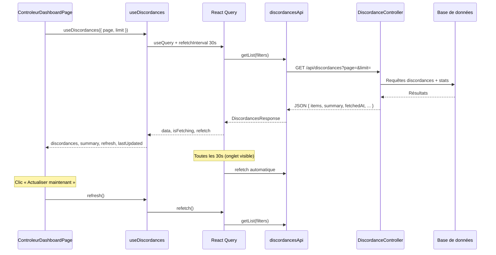

# Documentation — Module de polling (discordances Contrôleur)

> **Périmètre :** ce document décrit le mécanisme de **polling** (interrogation périodique) utilisé dans l'espace **Contrôleur** pour afficher les discordances IFU en quasi temps réel. Il couvre le frontend (hooks, UI, API client), le backend (`DiscordanceController`) et les règles métier associées.

---

## 1. Vue d'ensemble

Le polling permet au **Contrôleur** de voir les discordances se mettre à jour automatiquement sans recharger la page. Le serveur expose une API REST classique ; c'est le **navigateur** qui relance un appel toutes les **30 secondes**.

| Couche | Rôle |
|--------|------|
| **UI** | `ControleurDashboardPage` — tableau, stats, compte à rebours, bouton « Actualiser maintenant » |
| **Hook métier** | `useDiscordances` — charge les données via React Query avec `refetchInterval` |
| **Hook UI** | `usePollingCountdown` — affiche le décompte avant le prochain rafraîchissement |
| **Hook générique** | `usePolling` — alternative `setInterval` (disponible, non utilisée actuellement) |
| **API client** | `discordancesApi.getList()` → `GET /api/discordances` |
| **Backend** | `DiscordanceController::list()` — liste paginée + résumé statistique |

**Intervalle par défaut :** `POLLING_INTERVAL_MS = 30_000` (30 s), défini dans `src/utils/constants.ts`.

---

## 2. Contexte métier

| Référence | Description | Lien avec le polling |
|-----------|-------------|----------------------|
| **UC04** | Consultation des discordances par le Contrôleur | Cas d'usage principal du module |
| **RG-04** | Discordance = IFU Agent 1 ≠ IFU Agent 2 | Critère de sélection côté serveur |
| **RG-10** | Détection de discordance en moins de 2 secondes | S'applique à la **détection serveur** lors de la saisie, pas à la latence d'affichage UI |

### Distinction importante : détection vs affichage

- **Détection (RG-10)** : dès qu'Agent 2 enregistre une contre-saisie discordante, le backend calcule et persiste l'état en quelques secondes.
- **Affichage (polling)** : le dashboard Contrôleur interroge l'API toutes les 30 s. Une nouvelle discordance peut donc apparaître avec un délai maximal d'environ **30 secondes** (ou immédiatement si l'utilisateur clique sur **Actualiser maintenant**).

Le polling est un choix d'architecture **pull** (simple, sans WebSocket ni SSE). Il limite la charge serveur tout en offrant une expérience « quasi temps réel » adaptée au poste de contrôle.

---

## 3. Architecture globale



### Schéma des composants frontend

```
constants.ts (POLLING_INTERVAL_MS)
        │
        ▼
useDiscordances ──────────► discordancesApi ──► GET /api/discordances
        │                         ▲
        │ refresh, lastUpdated    │
        ▼                         │
ControleurDashboardPage ◄── usePollingCountdown
        │
        └── Bouton « Actualiser maintenant »
```

---

## 4. Fichiers du module

| Fichier | Rôle |
|---------|------|
| `src/utils/constants.ts` | Constante `POLLING_INTERVAL_MS` |
| `src/hooks/useDiscordances.ts` | Hook principal : données + polling React Query |
| `src/hooks/usePollingCountdown.ts` | Compte à rebours UI (secondes restantes) |
| `src/hooks/usePolling.ts` | Hook générique `setInterval` (réserve / réutilisable) |
| `src/api/discordancesApi.ts` | Client HTTP vers `/api/discordances` |
| `src/types/saisie.ts` | Types `DiscordancesFilters`, `DiscordancesResponse`, `ControleurSummary` |
| `src/features/controleur/ControleurDashboardPage.tsx` | Page consommatrice du module |
| `src/main.tsx` | Configuration globale React Query |
| `backend/src/Controller/Api/DiscordanceController.php` | Endpoint REST |
| `backend/config/packages/security.yaml` | Accès réservé `ROLE_CONTROLEUR` et `ROLE_ADMIN` |

---

## 5. Constante globale

**Fichier :** `src/utils/constants.ts`

```typescript
export const POLLING_INTERVAL_MS = 30_000;
```

Cette valeur est la **source unique de vérité** pour l'intervalle de polling côté frontend. Elle est utilisée par :

- `useDiscordances` (`refetchInterval`, `staleTime`)
- `ControleurDashboardPage` (texte UI + `usePollingCountdown`)

Pour modifier l'intervalle, changer uniquement cette constante (et vérifier que le backend supporte la charge correspondante).

---

## 6. Hook principal — `useDiscordances`

**Fichier :** `src/hooks/useDiscordances.ts`

### 6.1 Responsabilité

Encapsule une requête React Query sur les discordances et configure le rafraîchissement automatique.

### 6.2 Configuration React Query

```typescript
useQuery({
  queryKey: ['discordances', filters],
  queryFn: () => discordancesApi.getList(filters),
  refetchInterval: POLLING_INTERVAL_MS,           // 30 000 ms
  refetchIntervalInBackground: false,             // pause si onglet masqué
  staleTime: POLLING_INTERVAL_MS - 5_000,         // 25 000 ms
});
```

| Option | Valeur | Effet |
|--------|--------|-------|
| `queryKey` | `['discordances', filters]` | Cache séparé par page / limite |
| `refetchInterval` | 30 000 ms | Relance `queryFn` toutes les 30 s |
| `refetchIntervalInBackground` | `false` | **Aucun polling** quand l'onglet est en arrière-plan |
| `staleTime` | 25 000 ms | Les données restent « fraîches » 25 s ; évite des refetch superflus hors cycle |

### 6.3 Valeur retournée

| Propriété | Type | Description |
|-----------|------|-------------|
| `discordances` | `Discordance[]` | Lignes de la page courante |
| `count` | `number` | Nombre total de discordances actives |
| `total` | `number` | Total pour la pagination |
| `totalPages` | `number` | Nombre de pages |
| `summary` | `ControleurSummary \| null` | Cartes statistiques du dashboard |
| `lastUpdated` | `string \| null` | Horodatage ISO `fetchedAt` renvoyé par le serveur |
| `isLoading` | `boolean` | Premier chargement (pas encore de données) |
| `isFetching` | `boolean` | Requête en cours (initial, polling ou manuel) |
| `error` | `Error \| null` | Erreur réseau ou API |
| `refresh` | `() => Promise<...>` | Rafraîchissement manuel (`query.refetch`) |

### 6.4 Pagination et clé de cache

La page Contrôleur appelle :

```typescript
useDiscordances({ page, limit: PAGE_SIZE }); // PAGE_SIZE = 5
```

Chaque changement de `page` modifie `filters` → nouvelle `queryKey` → **nouveau cycle de polling** pour cette page. Les pages déjà visitées restent en cache React Query selon la politique par défaut du client.

---

## 7. Hook UI — `usePollingCountdown`

**Fichier :** `src/hooks/usePollingCountdown.ts`

### 7.1 Responsabilité

Affiche un **compte à rebours** en secondes jusqu'au prochain rafraîchissement automatique. Ce hook ne déclenche **aucun** appel API : il est purement visuel.

### 7.2 Signature

```typescript
function usePollingCountdown(intervalMs: number, resetKey: string | null): number
```

- `intervalMs` : intervalle total (ex. `POLLING_INTERVAL_MS`)
- `resetKey` : clé de réinitialisation — en pratique `lastUpdated` (`fetchedAt`)
- **Retour** : nombre de secondes restantes

### 7.3 Comportement

1. Au montage : initialise à `intervalMs / 1000` (ex. 30 s).
2. Chaque seconde : décrémente de 1 ; à 0, repart à 30.
3. Quand `resetKey` change (nouvelle réponse API) : remet le compteur à 30.

### 7.4 Utilisation dans la page

```typescript
const secondsLeft = usePollingCountdown(POLLING_INTERVAL_MS, lastUpdated);
```

Le texte affiché : *« Prochain rafraîchissement dans {secondsLeft}s »*.

**Note :** le compte à rebours est **approximatif** par rapport au timer interne de React Query (décalage possible de 1–2 s). Il sert d'indicateur utilisateur, pas de synchronisation exacte.

---

## 8. Hook générique — `usePolling`

**Fichier :** `src/hooks/usePolling.ts`

### 8.1 Responsabilité

Hook bas niveau basé sur `setInterval` et la **Page Visibility API**. Prévu pour des cas où React Query n'est pas utilisé.

### 8.2 Signature

```typescript
function usePolling(
  callback: () => void | Promise<void>,
  intervalMs: number = 30_000,
  enabled: boolean = true,
): void
```

### 8.3 Comportement

| Événement | Action |
|-----------|--------|
| Montage (`enabled = true`) | Exécute `callback` immédiatement, puis toutes les `intervalMs` |
| Onglet masqué (`visibilityState === 'hidden'`) | `clearInterval` — polling suspendu |
| Onglet visible à nouveau | Exécute `callback` immédiatement, relance l'intervalle |
| Démontage ou `enabled = false` | Nettoyage intervalle + listener |

### 8.4 Statut actuel dans le projet

**Non utilisé** par `ControleurDashboardPage`. Le dashboard s'appuie sur React Query (`useDiscordances`). `usePolling` reste disponible pour d'autres écrans ou une migration future.

### 8.5 Comparaison des deux approches

| Critère | `useDiscordances` (React Query) | `usePolling` (setInterval) |
|---------|--------------------------------|----------------------------|
| Cache / déduplication | Oui | Non |
| Gestion erreurs / retry | Oui (config globale) | Manuelle |
| Pause onglet masqué | `refetchIntervalInBackground: false` | Page Visibility API |
| Rafraîchissement manuel | `refresh()` natif | À implémenter |
| État `isFetching` | Natif | À implémenter |

---

## 9. Client API — `discordancesApi`

**Fichier :** `src/api/discordancesApi.ts`

```typescript
discordancesApi.getList(filters?: DiscordancesFilters): Promise<DiscordancesResponse>
```

### 9.1 Requête HTTP

```
GET /api/discordances?page={page}&limit={limit}
```

Les cookies JWT (`access_token`) sont envoyés automatiquement par `apiClient` (Axios, `withCredentials: true`).

### 9.2 Types de réponse

**Fichier :** `src/types/saisie.ts`

```typescript
interface DiscordancesFilters {
  page?: number;
  limit?: number;
}

interface DiscordancesResponse extends PaginatedResponse<Discordance> {
  count: number;
  fetchedAt: string;           // ISO 8601 — horodatage serveur
  summary: ControleurSummary;
}

interface ControleurSummary {
  discordances: number;
  concordants: number;
  enAttenteContresaisie: number;
  validationRate: number;      // pourcentage entier
  recentDelta: number;         // variation sur la dernière heure
  averageDelayMinutes: number | null;
}
```

---

## 10. Backend — `DiscordanceController`

**Fichier :** `backend/src/Controller/Api/DiscordanceController.php`

### 10.1 Endpoint

| Méthode | Route | Rôle requis |
|---------|-------|-------------|
| `GET` | `/api/discordances` | `ROLE_CONTROLEUR` ou `ROLE_ADMIN` |

Configuration : `backend/config/packages/security.yaml` (ligne `^/api/discordances`).

### 10.2 Paramètres de requête

| Paramètre | Défaut | Description |
|-----------|--------|-------------|
| `page` | `1` | Numéro de page (via `Pagination::parse`) |
| `limit` | `20` | Taille de page (le frontend Contrôleur utilise `5`) |

### 10.3 Corps de réponse (extrait)

```json
{
  "success": true,
  "data": {
    "items": [ /* Discordance[] */ ],
    "count": 12,
    "page": 1,
    "limit": 5,
    "total": 12,
    "totalPages": 3,
    "summary": {
      "discordances": 12,
      "concordants": 340,
      "enAttenteContresaisie": 8,
      "validationRate": 96,
      "recentDelta": 2,
      "averageDelayMinutes": 14
    },
    "fetchedAt": "2026-06-18T14:32:01+00:00"
  }
}
```

Le champ **`fetchedAt`** est généré à chaque réponse (`DateTimeImmutable::ATOM`). Il sert de signal côté UI pour réinitialiser le compte à rebours.

### 10.4 Rôle du backend dans le polling

Le backend est **stateless** : chaque appel `GET` recalcule les discordances et statistiques. Il n'y a pas de session de polling côté serveur. La charge est proportionnelle au nombre de contrôleurs connectés × (1 requête / 30 s par onglet actif).

---

## 11. Interface utilisateur — `ControleurDashboardPage`

**Fichier :** `src/features/controleur/ControleurDashboardPage.tsx`

### 11.1 Intégration des hooks

```typescript
const {
  discordances, count, total, totalPages, summary,
  lastUpdated, isLoading, isFetching, error, refresh,
} = useDiscordances({ page, limit: PAGE_SIZE });

const secondsLeft = usePollingCountdown(POLLING_INTERVAL_MS, lastUpdated);
```

### 11.2 Bandeau de statut

Affiche :

- Un indicateur visuel (point rouge, pulsation si `isFetching`)
- Le texte : *« Actualisation automatique toutes les 30s | Prochain rafraîchissement dans Xs »*

### 11.3 Bouton « Actualiser maintenant »

| Propriété | Comportement |
|-----------|--------------|
| `onClick` | `void refresh()` — relance immédiatement `GET /api/discordances` |
| `disabled` | `isFetching` — évite les doubles clics pendant un chargement |
| Icône | `IconRefresh` avec `animate-spin` pendant `isFetching` |
| Accessibilité | `aria-label="Actualiser les discordances maintenant"` |

Le rafraîchissement manuel **réinitialise** aussi le compte à rebours via le nouveau `fetchedAt`.

### 11.4 États d'affichage

| État | Rendu |
|------|-------|
| `isLoading` (premier chargement) | `Spinner` centré |
| `error` | `Alert` avec message extrait de l'API |
| `count === 0` | Message de succès « Aucune discordance détectée » |
| Données disponibles | Cartes stats + tableau paginé |

---

## 12. Configuration React Query globale

**Fichier :** `src/main.tsx`

```typescript
const queryClient = new QueryClient({
  defaultOptions: {
    queries: {
      retry: 1,
      refetchOnWindowFocus: false,
    },
  },
});
```

| Option globale | Impact sur le polling |
|----------------|----------------------|
| `retry: 1` | En cas d'échec réseau, une nouvelle tentative avant erreur |
| `refetchOnWindowFocus: false` | Pas de refetch au retour sur l'onglet (le polling reprend via `refetchInterval` quand l'onglet redevient visible, car `refetchIntervalInBackground: false`) |

---

## 13. Cycle de vie complet (scénario type)

1. Le Contrôleur ouvre `/controleur/dashboard`.
2. `useDiscordances` lance immédiatement `GET /api/discordances?page=1&limit=5`.
3. La page affiche stats + tableau ; `lastUpdated` alimente le compte à rebours (30 s).
4. Toutes les 30 s (onglet actif), React Query refetch silencieusement.
5. Pendant le fetch : `isFetching = true` → point pulsant + icône bouton qui tourne.
6. Réponse reçue : données mises à jour, `fetchedAt` change → compte à rebours remis à 30.
7. L'utilisateur change de page → nouvelle `queryKey` → nouveau fetch + polling pour la page 2.
8. L'utilisateur masque l'onglet → polling suspendu.
9. Retour sur l'onglet → React Query reprend le cycle ; refetch au prochain tick ou selon l'état stale.
10. Clic « Actualiser maintenant » → `refresh()` → fetch immédiat.

---

## 14. Sécurité et accès

- Seuls les utilisateurs **`ROLE_CONTROLEUR`** et **`ROLE_ADMIN`** peuvent appeler `/api/discordances`.
- L'authentification passe par le cookie HttpOnly `access_token` (voir `docs/authentification.md`).
- Un agent ou un utilisateur non autorisé recevra une réponse **403** ; React Query exposera l'erreur via `error` dans le hook.

---

## 15. Performance et bonnes pratiques

### Charge serveur

- 1 contrôleur, 1 onglet actif ≈ **2 requêtes/minute** (hors rafraîchissements manuels).
- Le polling est **désactivé en arrière-plan** pour limiter les appels inutiles.

### Recommandations

- Ne pas abaisser l'intervalle en dessous de 10–15 s sans analyse de charge.
- Éviter d'ouvrir plusieurs onglets Contrôleur sur la même session (chaque onglet poll indépendamment).
- Pour un vrai temps réel (&lt; 2 s à l'écran), il faudrait migrer vers **SSE** ou **WebSocket** — hors périmètre actuel.

---

## 16. Extension du module

### Ajouter le polling à un autre écran

**Option A — React Query (recommandée, alignée sur le dashboard)**

```typescript
const { data, refetch, isFetching } = useQuery({
  queryKey: ['ma-ressource', filters],
  queryFn: () => monApi.getList(filters),
  refetchInterval: POLLING_INTERVAL_MS,
  refetchIntervalInBackground: false,
  staleTime: POLLING_INTERVAL_MS - 5_000,
});
```

**Option B — Hook générique**

```typescript
usePolling(() => void fetchData(), POLLING_INTERVAL_MS, isEnabled);
```

### Afficher l'heure de dernière mise à jour

Utiliser `formatTime(lastUpdated)` depuis `src/utils/formatDate.ts` :

```typescript
import { formatTime } from '@/utils/formatDate';

// Exemple : « Dernière mise à jour : 14:32:01 »
{lastUpdated && <span>Dernière mise à jour : {formatTime(lastUpdated)}</span>}
```

### Modifier l'intervalle

1. Changer `POLLING_INTERVAL_MS` dans `constants.ts`.
2. Vérifier le texte UI (déjà dynamique via `POLLING_INTERVAL_MS / 1000`).
3. Ajuster `staleTime` si nécessaire (convention actuelle : `interval - 5_000`).

---

## 17. Dépannage

| Symptôme | Cause probable | Piste |
|----------|----------------|-------|
| Données figées | Onglet en arrière-plan | Normal — polling suspendu |
| Compte à rebours désynchronisé | Timer UI indépendant de React Query | Cosmétique ; le fetch a bien lieu à 30 s |
| Erreur au chargement | Token expiré / rôle insuffisant | Vérifier auth et `security.yaml` |
| Pas de mise à jour après saisie | Délai max du polling (30 s) | Utiliser « Actualiser maintenant » |
| Double chargement au montage | StrictMode React (dev) | Comportement attendu en développement |

---

## 18. Récapitulatif

Le module de polling du Contrôleur repose sur une stack simple et maintenable :

1. **React Query** assure le rafraîchissement périodique et le cache (`useDiscordances`).
2. **`usePollingCountdown`** informe l'utilisateur du prochain cycle automatique.
3. **`refresh()`** permet un rafraîchissement à la demande.
4. Le **backend** reste une API REST sans état, avec `fetchedAt` pour synchroniser l'UI.
5. **`usePolling`** reste une alternative générique non branchée sur le dashboard actuel.

Pour toute évolution vers du temps réel strict (RG-10 côté affichage), une refonte push (SSE/WebSocket) serait nécessaire ; le présent module reste le point d'extension naturel côté consommation de données.
