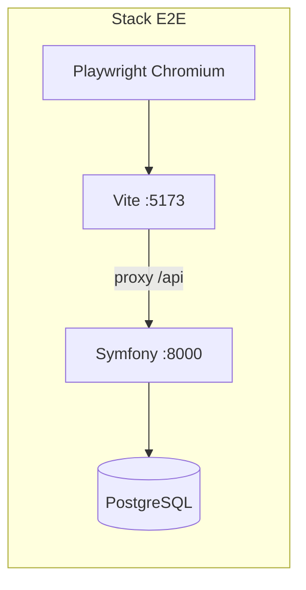

# Documentation — Tests E2E (Playwright) Arrimage IFU

> **Périmètre :** tests fonctionnels bout-en-bout via navigateur (React + API Symfony + PostgreSQL).  
> Complète les [tests unitaires](tests-unitaires.md) et les [tests d'intégration](tests-integration.md).

---

## 1. Vue d'ensemble

| Suite | Outil | Emplacement | Commande | Scénarios |
|-------|-------|-------------|----------|-----------|
| **E2E** | Playwright 1.x | `e2e/` | `npm test` (depuis `e2e/`) | **10 tests** |



### Fichiers de test

| Fichier | Parcours |
|---------|----------|
| `auth.spec.ts` | Connexion, erreur, déconnexion, garde routes |
| `agent1-saisie.spec.ts` | Nouvelle saisie IFU |
| `agent2-contresaisie.spec.ts` | Contresaisie concordante |
| `discordance.spec.ts` | Tableau discordances contrôleur |
| `consolidation.spec.ts` | Export XLSX admin |

---

## 2. Prérequis

1. **PostgreSQL** accessible (même `DATABASE_URL` que le backend dev, fichier `backend/.env`).
2. **PHP 8.4+** avec extensions du backend (`pdo_pgsql`, etc.).
3. **Node.js 20+** pour le frontend et Playwright.
4. Dépendances installées :
   ```bash
   npm install
   cd e2e && npm install && npx playwright install chromium
   ```

La commande `app:reset-e2e` (appelée au démarrage et avant chaque test) exécute :
- `doctrine:database:create --if-not-exists`
- `doctrine:migrations:migrate`
- `TRUNCATE` + rechargement utilisateurs / employeurs

---

## 3. Exécution

### Automatique (recommandé)

Playwright démarre le backend PHP et Vite si nécessaire :

```bash
cd e2e
npm test
```

### Avec interface graphique

```bash
npm run test:ui
```

### Navigateur visible

```bash
npm run test:headed
```

### Rapport HTML

```bash
npm run report
```

### Serveurs déjà lancés

Si vous avez déjà `php -S 127.0.0.1:8000 -t public` (backend) et `npm run dev` (frontend) :

```bash
cd e2e
npm test
```

(`reuseExistingServer: true` hors CI)

---

## 4. Identifiants de test

Alignés sur `app:reset-e2e` / `app:seed-dev` :

| Utilisateur | Mot de passe | Dashboard |
|-------------|--------------|-----------|
| admin | admin | `/admin/dashboard` |
| agent1 | Agent1@2026 | `/agent1/dashboard` |
| agent2 | Agent2@2026 | `/agent2/dashboard` |
| controleur | Ctrl@2026 | `/controleur/dashboard` |

Employeurs CNSS : `CNSS001234567`, `CNSS009876543`, `CNSS005555555`.

---

## 5. Architecture

```
e2e/
├── playwright.config.ts    # webServers, baseURL, globalSetup
├── global-setup.ts         # reset DB initial
├── support/
│   ├── auth.ts             # loginAs, logout, gotoLogin
│   ├── credentials.ts      # USERS, EMPLOYEURS, IFU
│   ├── db.ts               # resetE2eDatabase()
│   └── saisie.ts           # fillSaisieForm, submit*
└── tests/
    └── *.spec.ts
```

**Backend :** `backend/src/Command/ResetE2eCommand.php` (`app:reset-e2e`).

**Isolation :** `workers: 1`, `fullyParallel: false`, reset DB dans `beforeEach` de chaque spec.

---

## 6. Dépannage

| Problème | Solution |
|----------|----------|
| Échec connexion PostgreSQL | Vérifier `backend/.env`, démarrer PostgreSQL |
| Port 5173 / 8000 occupé | Arrêter les processus ou définir `E2E_BASE_URL` |
| Timeout consolidation | Normal sur gros volumes ; timeout test = 60 s |
| Chromium manquant | `npx playwright install chromium` |
| Rate limit login | Reset DB vide les compteurs ; redémarrer si cache persistant |

---

## 7. Périmètre non couvert

| Sujet | Piste |
|-------|-------|
| Gestion utilisateurs admin (drawer) | Spec dédié `admin-users.spec.ts` |
| Journal d'audit (filtres, export) | Spec admin audit |
| Changement mot de passe 1ère connexion | Créer user `isFirstConnexion` via API |
| Tests de charge | k6 / `app:seed-perf` |

---

## 8. Références

| Sujet | Document |
|-------|----------|
| Tests unitaires | [tests-unitaires.md](tests-unitaires.md) |
| Tests intégration | [tests-integration.md](tests-integration.md) |
| Authentification | [authentification.md](authentification.md) |
| Consolidation | [consolidation.md](consolidation.md) |

---

*Dernière mise à jour : juin 2026 — 10 tests E2E Playwright.*
