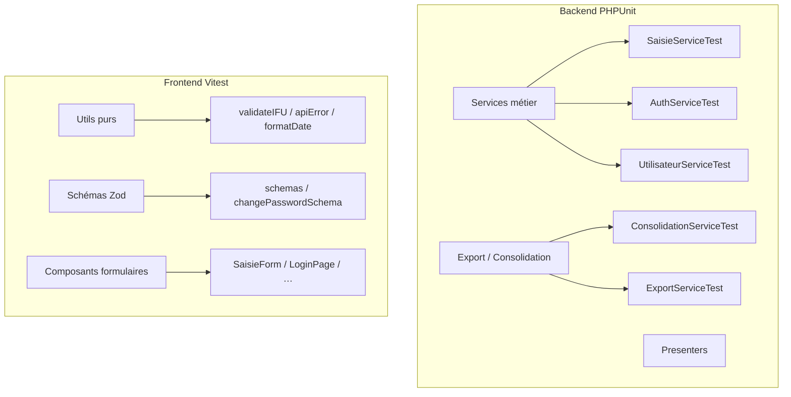

# Documentation — Tests unitaires Arrimage IFU

> **Périmètre de ce document :** tests unitaires backend (PHPUnit) et frontend (Vitest).  
> Les tests d'intégration API, les tests fonctionnels E2E et les tests de charge ne sont **pas** couverts ici (voir [§ 12](#12-périmètre-non-couvert-et-perspectives)).

---

## 1. Vue d'ensemble

Le projet Arrimage IFU dispose de **deux suites de tests unitaires indépendantes** :

| Suite | Outil | Emplacement | Commande | Tests (état actuel) |
|-------|-------|-------------|----------|---------------------|
| **Backend** | PHPUnit 13 | `backend/tests/` | `composer test` | **63 tests** |
| **Frontend** | Vitest 4 | `src/**/*.test.{ts,tsx}` | `npm test` | **47 tests** |

**Total : 110 tests unitaires.**



### Principes directeurs

1. **Un fichier de test par service** côté backend (`cursor/.rules.mdc`, règle 7.1).
2. **Scénario nominal + cas d'erreur** : chaque service critique teste le succès et les exceptions métier.
3. **Isolation** : repositories, connexion DBAL et JWT sont mockés ; pas de base PostgreSQL requise pour les tests unitaires.
4. **Frontend** : les utilitaires et schémas sont testés sans DOM ; les formulaires utilisent jsdom + Testing Library avec APIs mockées.

---

## 2. Exécution rapide

### Backend

```bash
cd ../backend
composer test
```

Équivalent direct :

```bash
php vendor/bin/phpunit
```

Variables d'environnement : `APP_ENV=test` est forcé par `phpunit.dist.xml`. Le fichier `.env` local est chargé via `tests/bootstrap.php`.

### Frontend

```bash
npm test          # exécution unique (CI)
npm run test:watch  # mode interactif pendant le développement
```

### Exécuter un sous-ensemble

```bash
# Un fichier backend
php vendor/bin/phpunit tests/Unit/Service/SaisieServiceTest.php

# Un fichier frontend
npx vitest run src/utils/validateIFU.test.ts

# Filtrer par nom de test (Vitest)
npx vitest run -t "login"
```

---

## 3. Interprétation des résultats

### Backend — `OK, but there were issues!`

PHPUnit peut afficher :

```
OK, but there were issues!
Tests: 63, Assertions: 241, PHPUnit Deprecations: 4, PHPUnit Notices: 45.
```

| Symbole / message | Signification |
|-------------------|---------------|
| `.` | Test réussi |
| `N` | Test réussi avec **notice** PHPUnit (souvent liée aux mocks) |
| `D` | Test réussi avec **dépréciation** détectée |
| `F` | **Échec** |
| `E` | **Erreur** (exception non attendue) |

Tant qu'il n'y a pas de `F` ni de `E`, **tous les tests sont passés**. Les notices et dépréciations sont des signaux d'amélioration, pas des blocages fonctionnels.

La configuration active une politique stricte :

```xml
failOnDeprecation="true"
failOnNotice="true"
failOnWarning="true"
```

### Frontend — avertissements React Router

Lors des tests de composants, `stderr` peut afficher :

```
React Router Future Flag Warning: v7_startTransition …
```

Ce sont des **avertissements de migration** vers React Router v7. Ils n'indiquent pas un échec de test. La sortie Vitest reste :

```
Test Files  11 passed (11)
Tests       47 passed (47)
```

---

## 4. Architecture backend (PHPUnit)

### 4.1 Arborescence

```
../backend/
├── phpunit.dist.xml          # Configuration principale
├── tests/
│   ├── bootstrap.php         # Autoload + Dotenv
│   └── Unit/
│       └── Service/          # Un fichier par service
│           ├── AuthServiceTest.php
│           ├── SaisieServiceTest.php
│           ├── UtilisateurServiceTest.php
│           ├── ConsolidationServiceTest.php
│           ├── ExportServiceTest.php
│           ├── AuditServiceTest.php
│           ├── AuditSnapshotFactoryTest.php
│           ├── AuditLogPresenterTest.php
│           ├── SaisiePresenterTest.php
│           ├── StatsServiceTest.php
│           └── JwtCookieServiceTest.php
└── composer.json             # script "test": "phpunit"
```

### 4.2 Conventions de nommage

| Élément | Convention | Exemple |
|---------|------------|---------|
| Classe de test | `{Service}Test` | `SaisieServiceTest` |
| Namespace | `App\Tests\Unit\Service` | — |
| Méthode | `test{Comportement}{Condition}` | `testCreateSaisieThrowsWhenDuplicateCnss` |
| Fichier source | Miroir du service testé | `src/Service/SaisieService.php` |

### 4.3 Pattern de test type

Chaque test de service suit la structure **Arrange → Act → Assert** avec mocks PHPUnit :

```php
final class SaisieServiceTest extends TestCase
{
  private SaisieRepository&MockObject $saisieRepository;
  private SaisieService $service;

  protected function setUp(): void
  {
    $this->saisieRepository = $this->createMock(SaisieRepository::class);
    // … autres dépendances mockées
    $this->service = new SaisieService(/* injections */);
  }

  public function testCreateSaisieThrowsWhenEmployeurNotFound(): void
  {
    $this->employeurRepository->method('find')->willReturn(null);
    $this->expectException(CnssNotFoundException::class);
    $this->service->createSaisie($dto, $agent);
  }
}
```

**Points clés :**

- Les **repositories** et `EntityManagerInterface` sont systématiquement mockés.
- `AuditService` utilise une vraie instance branchée sur un `Connection` mocké pour vérifier les `insert('audit_log', …)`.
- Les **exceptions métier** (`CnssNotFoundException`, `LastAdminException`, etc.) sont assertées via `expectException()`.
- Les **logs d'audit** sont vérifiés via `$this->callback()` sur les payloads JSON.

### 4.4 Cas particuliers

#### Services `final` non mockables

`ExportService` est déclaré `final`. Dans `ConsolidationServiceTest`, on injecte une **instance réelle** d'`ExportService` (génération XLSX réelle vers fichiers temporaires) tout en mockant `Connection` et les repositories.

#### Tests avec fichiers temporaires

`ExportServiceTest` et `ConsolidationServiceTest` créent des fichiers `.xlsx` dans `sys_get_temp_dir()`. Un `tearDown()` ou un bloc `finally` supprime ces fichiers après chaque test.

#### Presenters et factories

`SaisiePresenter`, `AuditLogPresenter` et `AuditSnapshotFactory` sont testés **sans mock** : entrées = entités Doctrine construites en mémoire, sorties = tableaux PHP assertés.

---

## 5. Inventaire détaillé — Backend (63 tests)

### 5.1 `AuthServiceTest` (13 tests) — UC01, RG-09, RG-14

| Test | Comportement vérifié |
|------|----------------------|
| `testLoginLogsRefusedWhenUserUnknown` | Utilisateur inconnu → `LOGIN_REFUSEE` + `InvalidCredentialsException` |
| `testLoginLogsRefusedWhenPasswordInvalid` | Mot de passe incorrect → audit + incrément tentatives |
| `testLoginLogsRefusedWhenAccountDisabled` | Compte désactivé → `AccountDisabledException` |
| `testLoginLogsRefusedWhenAccountLocked` | Compte verrouillé → `AccountLockedException` |
| `testLoginLogsAccountLockoutOnFifthFailedAttempt` | 5ᵉ échec → verrouillage + audit `ACCOUNT_LOCKOUT` |
| `testLoginSuccessReturnsTokensAndResetsAttempts` | Login OK → tokens JWT, reset tentatives, audit `LOGIN` |
| `testRefreshRenewsTokensForValidRefreshPayload` | Refresh token valide → nouveaux tokens |
| `testRefreshThrowsWhenTokenIsNotRefreshType` | Token access → `InvalidCredentialsException` |
| `testRefreshThrowsWhenUserIsInactive` | Utilisateur inactif au refresh → refus |
| `testExtractRefreshTokenReadsCookie` | Lecture cookie `refresh_token` |
| `testExtractRefreshTokenReturnsNullWhenCookieMissing` | Cookie absent → `null` |
| `testChangePasswordLogsSuccess` | Changement mdp OK → audit `CHANGE_PASSWORD` |
| `testChangePasswordLogsRefusedWhenCurrentPasswordInvalid` | Mauvais mdp actuel → `CHANGE_PASSWORD_REFUSEE` |

### 5.2 `SaisieServiceTest` (16 tests) — UC02, UC03, UC05, RG-01 à RG-07, RG-11

| Test | Comportement vérifié |
|------|----------------------|
| `testCreateSaisieThrowsWhenEmployeurNotFound` | CNSS inconnu → `CnssNotFoundException` |
| `testCreateSaisieThrowsWhenDuplicateCnss` | Doublon CNSS → `DuplicateSaisieException` |
| `testCreateSaisieThrowsWhenEntityConsolidated` | Saisie consolidée → `EntiteConsolideeException` |
| `testCreateSaisieSuccess` | Création Agent 1 → statut `SAISIE` |
| `testGetAttenteContresaisieReturnsEligibleContext` | Contexte éligible sans IFU Agent 1 (RG-11) |
| `testGetAttenteContresaisieLogsRefusedWhenNotSaisied` | Pas de saisie → `IneligibleContresaisieException` |
| `testGetAttenteContresaisieThrowsWhenConsolidated` | Consolidée → refus contresaisie |
| `testContresaisieSuccessUpdatesSaisie` | Contresaisie OK → `CONTRE_SAISIE` |
| `testContresaisieLogsRefusedWhenAlreadyCountered` | Déjà contresaisi → refus |
| `testContresaisieThrowsWhenConsolidated` | Consolidée → `EntiteConsolideeException` |
| `testCorrectionUpdatesIfuForAgent1` | Correction UC05 → audit `CORRECTION` |
| `testCorrectionThrowsWhenCnssNotFound` | CNSS absent → exception |
| `testCorrectionThrowsWhenConsolidated` | Entité verrouillée → exception |
| `testGetCorrectionContextReturnsAgentIfu` | Contexte correction avec IFU actuel |
| `testGetMesSaisiesPaginatedEnrichesRepositoryResult` | Pagination + stats agent |
| `testGetDiscordancesPaginatedEnrichesRepositoryResult` | Discordances + métriques |

### 5.3 `UtilisateurServiceTest` (9 tests) — UC08, RG-12, RG-14

| Test | Comportement vérifié |
|------|----------------------|
| `testToggleActiveThrowsForLastAdmin` | Dernier admin → `LastAdminException` |
| `testToggleActiveLogsAccountDisabled` | Désactivation → audit `ACCOUNT_DISABLED` |
| `testToggleActiveReenablesAccountAndLogs` | Réactivation → audit `ACCOUNT_ENABLED` |
| `testCreateUserGeneratesTemporaryPassword` | Création → mdp temporaire + `is_first_connexion` |
| `testCreateThrowsWhenUsernameAlreadyExists` | Doublon identifiant → exception |
| `testUpdatePersistsUserFields` | Modification nom/prénom/rôle |
| `testResetPasswordGeneratesTemporaryPassword` | Reset → mdp temporaire + audit |
| `testPresentFormatsUserForApi` | Sérialisation API utilisateur |
| `testFindPaginatedDelegatesToRepository` | Délégation pagination |

### 5.4 `ConsolidationServiceTest` (6 tests) — UC06, RG-06

| Test | Comportement vérifié |
|------|----------------------|
| `testPreviewDelegatesToRepositoryCounters` | Aperçu consolidation (count, duplicateCount) |
| `testConsolidateThrowsWhenNoEligibleRows` | Aucune donnée → `ConsolidationException` + rollback |
| `testConsolidateCompletesTransactionalFlow` | Flux transactionnel complet + audit `CONSOLIDATION` |
| `testRegenerateExportThrowsWhenAuditLogMissing` | Export introuvable |
| `testRegenerateExportThrowsWhenPayloadInvalid` | Payload audit invalide |
| `testRegenerateExportRebuildsFileFromAuditLog` | Re-téléchargement XLSX depuis audit log |

### 5.5 `ExportServiceTest` (4 tests) — UC06

| Test | Comportement vérifié |
|------|----------------------|
| `testWriteConsolidationXlsxToFileCreatesValidWorkbook` | Export streaming OpenSpout, magic bytes `PK` |
| `testGenerateXlsxReturnsNonEmptyBinaryContent` | Export PhpSpreadsheet en mémoire |
| `testGenerateAuditXlsxIncludesUserAndActionColumns` | Export journal audit |
| `testCreateTempXlsxPathEndsWithXlsxExtension` | Chemin fichier temporaire |

### 5.6 Autres services (15 tests)

| Fichier | Tests | Rôle |
|---------|-------|------|
| `AuditServiceTest` | 2 | Insertion `audit_log` (avec/sans utilisateur) |
| `AuditSnapshotFactoryTest` | 4 | Snapshots JSON saisie, utilisateur, refus login/saisie |
| `AuditLogPresenterTest` | 2 | Format API journal audit |
| `SaisiePresenterTest` | 3 | Présentation full / Agent 2 (masquage IFU) / discordance |
| `StatsServiceTest` | 2 | Agrégation statistiques admin |
| `JwtCookieServiceTest` | 2 | Cookies HttpOnly access + refresh |

---

## 6. Architecture frontend (Vitest)

### 6.1 Arborescence

```
frontend/
├── vitest.config.ts              # jsdom, alias @/, setup
├── src/
│   ├── test/
│   │   ├── setup.ts              # @testing-library/jest-dom
│   │   └── test-utils.tsx        # renderWithProviders, userEvent
│   ├── utils/
│   │   ├── validateIFU.test.ts
│   │   ├── generateUsername.test.ts
│   │   ├── apiError.test.ts
│   │   └── formatDate.test.ts
│   └── features/
│       ├── agent1/
│       │   ├── schemas.test.ts
│       │   └── SaisieForm.test.tsx
│       ├── agent2/
│       │   └── ContresaisieForm.test.tsx
│       ├── shared/
│       │   ├── changePasswordSchema.test.ts
│       │   └── CorrectionForm.test.tsx
│       └── auth/
│           ├── LoginPage.test.tsx
│           └── ChangePasswordPage.test.tsx
└── package.json                  # "test": "vitest run"
```

### 6.2 Configuration

**`vitest.config.ts`**

| Option | Valeur | Rôle |
|--------|--------|------|
| `environment` | `jsdom` | DOM simulé pour les composants React |
| `globals` | `true` | `describe` / `it` / `expect` sans import |
| `setupFiles` | `src/test/setup.ts` | Matchers jest-dom (`toBeInTheDocument`, etc.) |
| `plugins` | `@vitejs/plugin-react` | Transformation TSX |
| `resolve.alias` | `@` → `src/` | Même alias que l'app |

**Dépendances de test :**

- `vitest`
- `@testing-library/react`
- `@testing-library/jest-dom`
- `@testing-library/user-event`
- `jsdom`

### 6.3 Utilitaire `renderWithProviders`

Les composants qui utilisent React Query et React Router sont rendus via :

```typescript
import { renderWithProviders, screen, userEvent } from '@/test/test-utils';

renderWithProviders(<SaisieForm onSuccess={vi.fn()} />);
```

`TestProviders` encapsule :

- `QueryClientProvider` (retry désactivé en test)
- `MemoryRouter` (navigation sans navigateur réel)

### 6.4 Conventions de nommage

| Élément | Convention | Exemple |
|---------|------------|---------|
| Fichier utilitaire | `{module}.test.ts` | `validateIFU.test.ts` |
| Fichier composant | `{Component}.test.tsx` | `SaisieForm.test.tsx` |
| Cas de test | phrase descriptive en français | `it('rejette un IFU trop court', …)` |
| Mocks API | `vi.mock('@/api/…')` en tête de fichier | — |

### 6.5 Patterns de test

#### Utilitaires purs (sans DOM)

Tests synchrones ou async simples, pas de `render` :

```typescript
describe('validateIFU', () => {
  it('accepte un IFU de 13 chiffres', () => {
    expect(validateIFU('1234567890123')).toBe(true);
  });
});
```

#### Schémas Zod

Validation via `safeParse` et inspection des messages d'erreur :

```typescript
const result = saisieSchema.safeParse({ numCnss: '', ifu: '…', … });
expect(result.success).toBe(false);
```

#### Composants formulaires

1. **Mocker les APIs** (`employeurApi`, `saisieApi`, `authApi`) avec `vi.fn()`.
2. **Mocker les modules transverses** (`mesSaisiesQuery`, `authStore`, `useNavigate`).
3. **Interactions utilisateur** via `userEvent` (saisie, clic).
4. **Soumission forcée** via `fireEvent.submit(form)` quand le bouton est `disabled` (validation Zod doit quand même s'exécuter).
5. **Sélecteurs précis** : `getByLabelText(/^Mot de passe$/i)` pour éviter les collisions (bouton « Afficher le mot de passe »).

Exemple de mock API :

```typescript
vi.mock('@/api/saisieApi', () => ({
  saisieApi: {
    create: (...args: unknown[]) => createSaisie(...args),
  },
}));
```

#### Dates relatives

`formatDate.test.ts` utilise `vi.useFakeTimers()` pour figer « aujourd'hui » et tester `formatRelativeLogin` (`Aujourd'hui`, `Hier`).

---

## 7. Inventaire détaillé — Frontend (47 tests)

### 7.1 Utilitaires (`src/utils/`) — 24 tests

| Fichier | Tests | Couverture |
|---------|-------|------------|
| `validateIFU.test.ts` | 5 | Format IFU 13 chiffres, `ifuSchema` Zod (RG-16) |
| `generateUsername.test.ts` | 4 | Génération identifiant `p.nom`, accents, cas limites |
| `apiError.test.ts` | 6 | `extractApiErrorMessage`, `extractBlobApiError` (500, timeout, blob JSON) |
| `formatDate.test.ts` | 9 | `formatDate`, `formatTime`, `formatRelativeLogin`, dates longues FR |

### 7.2 Schémas Zod — 9 tests

| Fichier | Tests | Couverture |
|---------|-------|------------|
| `schemas.test.ts` | 5 | `saisieSchema`, `ifuOnlySchema` — CNSS, IFU, confirmation |
| `changePasswordSchema.test.ts` | 4 | `changePasswordSchema`, `firstConnexionPasswordSchema` (RG-14) |

### 7.3 Composants — 14 tests

| Fichier | Tests | Comportements vérifiés |
|---------|-------|------------------------|
| `SaisieForm.test.tsx` | 3 | Validation vide, blocage sans lookup employeur, soumission OK |
| `ContresaisieForm.test.tsx` | 2 | IFU non concordants, contresaisie valide |
| `CorrectionForm.test.tsx` | 3 | Contexte lecture seule, refus confirmation, correction OK |
| `LoginPage.test.tsx` | 3 | Validation vide, redirection dashboard, première connexion |
| `ChangePasswordPage.test.tsx` | 3 | Affichage formulaire, refus mdp faible, soumission conforme |

---

## 8. Cartographie règles métier ↔ tests

| Règle / UC | Backend | Frontend |
|------------|---------|----------|
| **RG-01** Un CNSS unique (Agent 1) | `SaisieServiceTest` (doublon) | `schemas.test.ts` |
| **RG-06** Consolidation atomique | `ConsolidationServiceTest` | — |
| **RG-07** Verrouillage après consolidation | `SaisieServiceTest` (consolidée) | — |
| **RG-08** Audit append-only | `AuditServiceTest`, snapshots | — |
| **RG-09** JWT / cookies | `AuthServiceTest`, `JwtCookieServiceTest` | — |
| **RG-11** Masquage IFU Agent 2 | `SaisiePresenterTest` | — |
| **RG-12** Dernier admin protégé | `UtilisateurServiceTest` | — |
| **RG-14** Mdp première connexion | `AuthServiceTest`, `UtilisateurServiceTest` | `changePasswordSchema.test.ts`, `ChangePasswordPage.test.tsx` |
| **RG-16** IFU 13 chiffres | — | `validateIFU.test.ts`, `schemas.test.ts` |
| **UC01** Authentification | `AuthServiceTest` | `LoginPage.test.tsx` |
| **UC02** Saisie Agent 1 | `SaisieServiceTest` | `SaisieForm.test.tsx` |
| **UC03** Contresaisie Agent 2 | `SaisieServiceTest` | `ContresaisieForm.test.tsx` |
| **UC05** Correction discordance | `SaisieServiceTest` | `CorrectionForm.test.tsx` |
| **UC06** Consolidation / export | `ConsolidationServiceTest`, `ExportServiceTest` | — |
| **UC07** Stats admin | `StatsServiceTest` | — |
| **UC08** Gestion utilisateurs | `UtilisateurServiceTest` | — |

---

## 9. Ajouter un nouveau test unitaire

### 9.1 Backend — nouveau cas sur un service existant

1. Ouvrir `backend/tests/Unit/Service/{Service}Test.php`.
2. Ajouter une méthode `public function test…(): void`.
3. Configurer les mocks dans le test ou `setUp()`.
4. Exécuter : `php vendor/bin/phpunit tests/Unit/Service/{Service}Test.php`.

### 9.2 Backend — nouveau service

1. Créer `backend/tests/Unit/Service/{NewService}Test.php`.
2. Namespace `App\Tests\Unit\Service`.
3. Étendre `PHPUnit\Framework\TestCase`.
4. Mocker toutes les dépendances du constructeur.
5. Couvrir au minimum : **1 succès + 1 erreur métier**.

### 9.3 Frontend — nouvel utilitaire

1. Créer `src/utils/{module}.test.ts` à côté du source.
2. Importer `describe`, `it`, `expect` depuis `vitest`.
3. Pas besoin de `renderWithProviders` pour une fonction pure.

### 9.4 Frontend — nouveau composant formulaire

1. Créer `{Component}.test.tsx` à côté du composant.
2. Mocker les appels API avec `vi.mock()`.
3. Utiliser `renderWithProviders`.
4. Tester au minimum :
   - message d'erreur de validation ;
   - désactivation du submit quand les prérequis ne sont pas remplis ;
   - appel API au submit valide.

---

## 10. Bonnes pratiques du projet

### À faire

- Nommer les tests comme des **spécifications** (`testCreateSaisieThrowsWhenDuplicateCnss`).
- Vérifier les **effets de bord audit** (`audit_log`) pour les refus métier.
- Nettoyer les **fichiers temporaires** XLSX après les tests d'export.
- Utiliser des **données minimales** (entités construites en mémoire, sans fixture DB).
- Préférer `getByLabelText(/^Label exact$/i)` aux regex trop larges.

### À éviter

- Tests qui nécessitent PostgreSQL ou le serveur Symfony (→ tests d'intégration, hors périmètre unitaire).
- Mocker des classes `final` (utiliser l'instance réelle ou extraire une interface).
- `console.log` laissés dans les tests.
- Assertions sur l'implémentation interne plutôt que sur le comportement observable.

---

## 11. Dépannage

| Problème | Cause probable | Solution |
|----------|----------------|----------|
| `Class "…" is final and cannot be doubled` | Mock d'une classe `final` | Injecter l'instance réelle ou tester via une couche plus haute |
| Bouton submit `disabled`, validation non testée | Garde `canSubmit` côté composant | `fireEvent.submit(form)` |
| `Found multiple elements with the text of: /mot de passe/i` | Label + bouton aria-label | Sélecteur exact : `/^Mot de passe$/i` |
| PHPUnit notices (`N`) | Mocks PHPUnit 13 | Acceptable si tests verts ; affiner les expectations si besoin |
| Tests formatDate flaky | Fuseau horaire | Utiliser `vi.useFakeTimers()` ou assertions structurelles (`/21\/06\/2026/`) |

---

## 12. Périmètre non couvert et perspectives

Les tests unitaires **ne remplacent pas** :

| Type | Statut | Piste |
|------|--------|-------|
| **Tests d'intégration API** | Non implémentés | `WebTestCase` + client Symfony, endpoints `/api/*` par rôle |
| **Tests fonctionnels E2E** | Non implémentés | Playwright / Cypress sur parcours complets |
| **Tests de charge** | Outils CLI seulement | `app:seed-perf` + `app:consolidate-cli` (voir [consolidation.md](consolidation.md) § 13.5) |

Composants frontend **sans** tests unitaires dédiés aujourd'hui : routes (`GuestRoute`, `ProtectedRoute`), pages liste/historique, drawer admin, polling (`useDiscordances`), etc.

---

## 13. Références croisées

| Sujet | Document / ressource |
|-------|----------------------|
| Authentification testée | [authentification.md](authentification.md) |
| Consolidation testée | [consolidation.md](consolidation.md) |
| Audit logs | [audit-logs.md](audit-logs.md) |
| Règles de tests (Cursor) | `cursor/.rules.mdc` § 7 |
| Config PHPUnit | `backend/phpunit.dist.xml` |
| Config Vitest | `vitest.config.ts` |

---

*Dernière mise à jour : juin 2026 — 63 tests backend + 47 tests frontend.*
